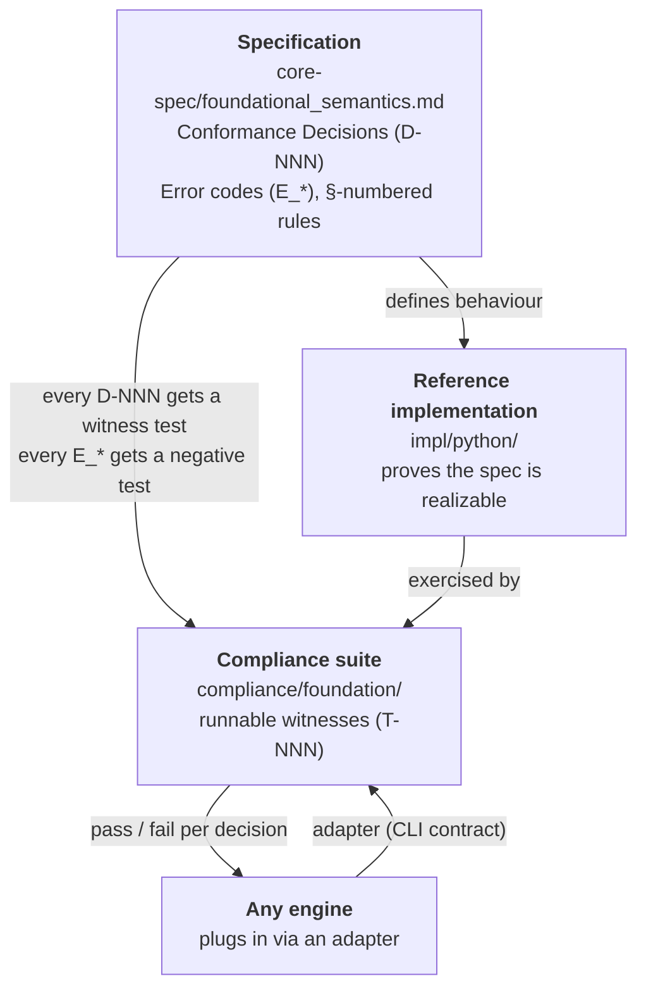
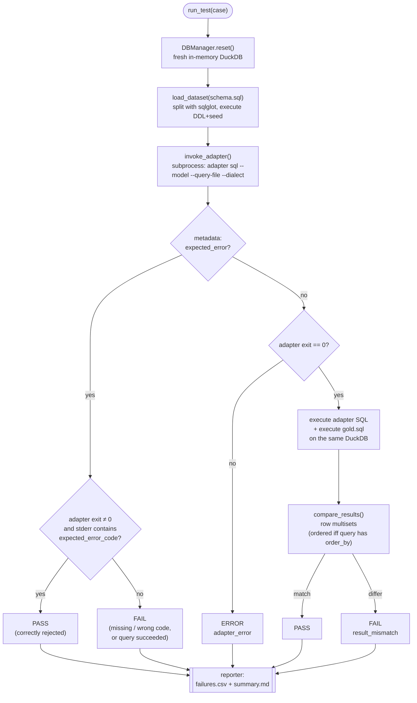
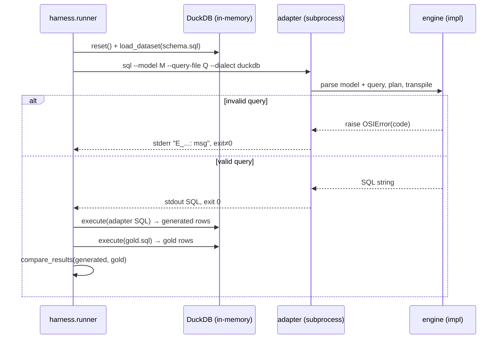
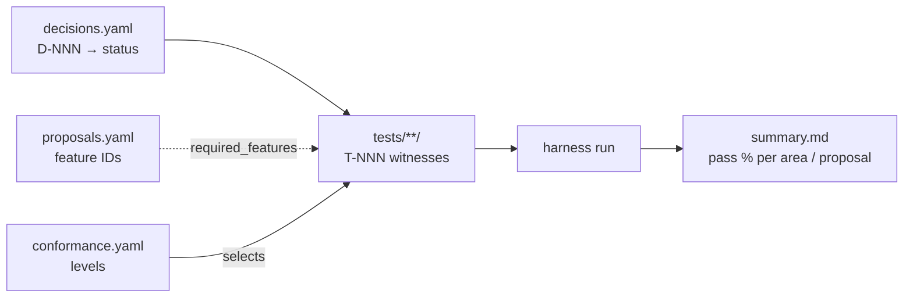

<!--
  Licensed to the Apache Software Foundation (ASF) under one
  or more contributor license agreements.  See the NOTICE file
  distributed with this work for additional information
  regarding copyright ownership.  The ASF licenses this file
  to you under the Apache License, Version 2.0 (the
  "License"); you may not use this file except in compliance
  with the License.  You may obtain a copy of the License at

    http://www.apache.org/licenses/LICENSE-2.0

  Unless required by applicable law or agreed to in writing,
  software distributed under the License is distributed on an
  "AS IS" BASIS, WITHOUT WARRANTIES OR CONDITIONS OF ANY
  KIND, either express or implied.  See the License for the
  specific language governing permissions and limitations
  under the License.
-->

# Ossie Compliance Suite — Architecture

This document explains how the Ossie compliance suite is put together: how a
**specification**, a **reference implementation**, and an **engine-agnostic
test harness** combine to answer one question — *does this engine implement
Ossie's semantics correctly?*

- Audience: contributors extending the suite, and engine vendors who want to
  claim Ossie conformance.
- Companion docs: [`README.md`](README.md) (how to run it),
  [`ADAPTER_INTERFACE.md`](ADAPTER_INTERFACE.md) (the harness↔engine contract),
  [`foundation/SPEC.md`](foundation/SPEC.md) (what the current suite targets).

---

## 1. The three-way contract

Ossie's semantics are defined once, in prose, and then pinned down by two
independent artifacts that must agree. The specification says *what* an engine
must do; the reference implementation shows that the "what" is achievable; the
compliance suite checks *any* engine against the "what" without caring how it is
built.



**Why behaviour, not code.** A compliance test never inspects an engine's
generated SQL string. Two conforming engines may emit wildly different SQL for
the same query. The suite asserts only on **observable behaviour**: the *rows*
a query returns, or the *error code* an invalid query raises. This is the
Foundation's determinism boundary (decision **D-014**): SQL text is a
per-engine concern, semantics are not.

---

## 2. Repository map

```
compliance/
├── README.md                # how to install & run (start here)
├── ARCHITECTURE.md          # this document
├── ADAPTER_INTERFACE.md     # the CLI contract every engine adapter satisfies
├── pyproject.toml           # uv workspace root (members: harness, foundation)
├── uv.lock                  # the workspace's single resolved lockfile
│
├── harness/                 # engine-agnostic runner — shared by every suite
│   ├── README.md
│   ├── pyproject.toml        # workspace member: osi_compliance_harness
│   └── src/harness/
│       ├── runner.py         # discovery, adapter invocation, orchestration, CLI
│       ├── db_manager.py     # in-memory DuckDB: load fixtures, execute SQL
│       ├── result_compare.py # order-insensitive, numeric-tolerant row compare
│       ├── reporter.py       # failures.csv + summary.md + console summary
│       ├── models.py         # TestCase / TestResult / SuiteResult dataclasses
│       └── proposals_check.py# CI gate: metadata references a known proposal ID
│
└── foundation/              # the Foundation v0.1 suite (one per spec version)
    ├── README.md
    ├── SPEC.md               # which spec sections this suite targets
    ├── DATA_TESTS.md         # the normative T-NNN test-vector catalogue
    ├── conformance.yaml      # named conformance levels (foundation_v0_1, …)
    ├── decisions.yaml        # D-NNN registry  ↔  the tests that witness each
    ├── proposals.yaml        # foundation / deferred feature registry
    ├── pyproject.toml        # workspace member: osi_compliance_foundation_v0_1
    ├── adapters/
    │   └── osi_python_adapter.py   # thin delegator to impl/python's adapter
    ├── datasets/
    │   └── f_prelude/        # a fixture: schema.sql (+ description.md)
    ├── tests/
    │   └── cross_grain/moderate/t-005*/   # one folder per test case
    └── results/             # runner output (gitignored except REPORT.md)
```

The **harness** is generic and version-independent. Each **suite** (`foundation/`
today; future spec versions get sibling directories) supplies the tests,
fixtures, adapters, and registries for one version of the spec, and depends on
the one shared harness.

`compliance/` is a single **uv workspace**: `harness/` and `foundation/` are its
members, so one `uv sync` at `compliance/` installs the whole suite into one
environment and `uv run` executes from anywhere beneath it. See
[`README.md`](README.md) for the install/run commands.

---

## 3. Harness runtime

The runner is invoked from a suite root (via `uv run`, which resolves the
workspace environment automatically):

```bash
uv run python -m harness.runner \
    --adapter adapters/osi_python_adapter.py \
    --tests tests/ \
    --datasets datasets/
```

### 3.1 What happens per test

`discover_tests()` walks `tests/**/metadata.yaml`. A folder is a test only if it
also contains `model.yaml`, `query.json`, and `gold.sql`. Each discovered test
then flows through `run_test()`:



Key behaviours worth knowing:

- **Isolation.** The DB is reset before every test; datasets are cached per
  connection so re-loading the same fixture within a run is a no-op.
- **Fixture loading is SQL-aware.** `schema.sql` is split with **sqlglot**
  (not `str.split(";")`), so semicolons inside string literals and comments
  don't break loading.
- **Row comparison is tolerant** (`result_compare.py`): case-insensitive column
  names, numeric epsilon `1e-4` (absolute or relative), date/datetime/time and
  `NULL`-aware, and **order-insensitive unless** the `query.json` declares an
  `order_by`.
- **Timeouts.** Each adapter invocation has a budget (`--timeout`, default 60s);
  exceeding it records `adapter_timeout` rather than hanging the run.
- **Outputs.** `reporter.write_reports()` writes `failures.csv` and `summary.md`
  under `--output` (default `results/latest/`), plus a console summary and a
  per-proposal status table. The curated baseline `results/REPORT.md` is the
  only tracked file under `results/`.

### 3.2 The adapter contract

The harness never imports an engine. It shells out to an **adapter** — a thin
translator that speaks the engine's API on one side and this CLI contract on the
other (full rules in [`ADAPTER_INTERFACE.md`](ADAPTER_INTERFACE.md)):

```
<adapter> sql --model <model.yaml> --query-file <query.json> --dialect <dialect>
```

| Stream | Meaning |
|--------|---------|
| **stdout** | the generated SQL string, and nothing else |
| **stderr** | `<ERROR_CODE>: <message>` on failure |
| **exit code** | `0` success, non-zero on error |



The adapter is deliberately **thin** — "about a page of code". It does format
conversion only. Any validation, SQL rewriting, parameter handling, or business
logic belongs in the engine, not the adapter. If a test fails because the engine
lacks a behaviour, the fix goes in the engine.

---

## 4. Anatomy of a test

Each test case is a directory of four files:

| File | Purpose |
|------|---------|
| `metadata.yaml` | `test_id: T-NNN`, `decision: D-NNN`, `area`, `difficulty`, `dataset`, `spec_refs`, `conformance_level`, `status`, `required_features`, and (for negatives) `expected_error` / `expected_error_code`. |
| `model.yaml` | the semantic model under test (datasets, fields, relationships, metrics) — usually a thin wrapper over a shared fixture. |
| `query.json` | the semantic query, in the two-shape format: `dimensions` + `measures` for aggregation queries, or `fields` for scalar queries. An `order_by` here makes comparison order-sensitive. |
| `gold.sql` | a hand-written reference query, run against the fixture to produce the expected row multiset. It is a **row oracle**, never compared to the engine's SQL as text. |

Example — the real `tests/cross_grain/moderate/t-005a-single-step-sum/`, which
witnesses **D-020** (single-step cross-grain `SUM` over a `1:N` edge):

```jsonc
// query.json — "total order amount by customer region"
{ "dataset": "customers",
  "dimensions": ["customers.region"],
  "measures": [ { "name": "total_order_amount", "metric": "total_order_amount" } ] }
```

```sql
-- gold.sql — the answer the engine must reproduce (row-for-row)
SELECT c.region AS region, SUM(o.amount) AS total_order_amount
FROM orders o
LEFT JOIN customers c ON o.customer_id = c.id
GROUP BY c.region
```

The engine sees only the model and the query; it must *derive* the join,
grain, and aggregation. The harness runs the engine's SQL and the `gold.sql`
against the same `f_prelude` fixture and checks the two row sets match.

Negative tests carry `expected_error_code: E_...` instead of relying on rows;
the harness passes them iff the adapter exits non-zero with that code in stderr.

---

## 5. Conformance & coverage model

Three registries under `foundation/` connect the spec to the tests on disk.

- **`decisions.yaml`** — every Conformance Decision `D-NNN` from the spec, each
  mapped to the `tests:` that witness it and a `status` (`must_pass` / `xfail`).
  This is the coverage ledger: a decision with an empty `tests:` list is a
  known gap.
- **`proposals.yaml`** — the feature registry (mirrors the spec's deferred-
  features section). Each entry is `status: foundation` (in scope; engines must
  implement) or `status: deferred` (out of scope; must be rejected with
  `E_DEFERRED_KEY_REJECTED`). Tests name entries via `required_features`; the
  runner **SKIP**s a test if an adapter doesn't advertise its features
  (`--proposals`). `proposals_check.py` is a CI gate against typos here.
- **`conformance.yaml`** — the named levels an engine can claim:

  | Level | Meaning |
  |-------|---------|
  | `foundation_v0_1` | Required. Every `must_pass` decision produces the expected rows/error. |
  | `foundation_v0_1_strict` | Optional. Adds per-engine determinism witnesses (D-014/D-029): the same `(model, query, dialect)` compiles to byte-identical SQL, `NULLS LAST` emitted explicitly. |

Cross-engine portability is observable behaviour (rows / error codes).
`_strict` is *per-engine* SQL determinism — a stronger, opt-in promise.



---

## 6. Extending the suite

**Add a test for a decision.** Create `tests/<area>/<difficulty>/t-NNN-slug/`
with the four files, set `decision:` + `spec_refs:` in `metadata.yaml`, and add
the folder to that decision's `tests:` list in `decisions.yaml`.

**Support a new feature/proposal.** Add it to `proposals.yaml` with a status,
reference it from the tests that need it via `required_features`, and — once it
is ratified — add a conformance level in `conformance.yaml`.

**Plug in a new engine.** Write an adapter that satisfies the CLI contract
(see [`ADAPTER_INTERFACE.md`](ADAPTER_INTERFACE.md)) and run the existing suite
against it. No suite changes are needed — that is the whole point of the
engine-agnostic design.

**Target a new spec version.** Add a sibling suite directory (e.g.
`compliance/<version>/`) with its own registries and tests, reusing the shared
`harness/`.

---

## 7. Current status (bootstrap slice)

The Foundation suite is intentionally a **thin bootstrap slice** today, enough
to make the whole mechanism runnable end to end:

- **Spec source of truth:** the Foundation semantics land as
  [`../core-spec/foundational_semantics.md`](../core-spec/foundational_semantics.md)
  (Conformance Decisions `D-NNN`, error-code index, and the §-numbered rules),
  with the expression subset in
  [`../core-spec/expression_language.md`](../core-spec/expression_language.md).
- **Tests present:** only the `t-005{a,b,d,e}` cross-grain cases (all pinned to
  **D-020**); the other decisions in `decisions.yaml` carry an empty `tests:`
  pending follow-up PRs.
- **No engine yet:** `impl/python/` is a placeholder, so
  `adapters/osi_python_adapter.py` has nothing to delegate to. Until an
  implementation lands, the runnable path is **`--list`** (test discovery and
  registry validation, no engine required):

  ```bash
  cd compliance && uv sync
  cd foundation
  uv run python -m harness.runner --list --tests tests/ --include-planned
  ```

- The four bootstrap tests carry `status: planned`, so a real run skips them
  unless `--include-planned` is passed.

See [`foundation/README.md`](foundation/README.md) for the per-slice detail and
the running list of what is still to be ported.
