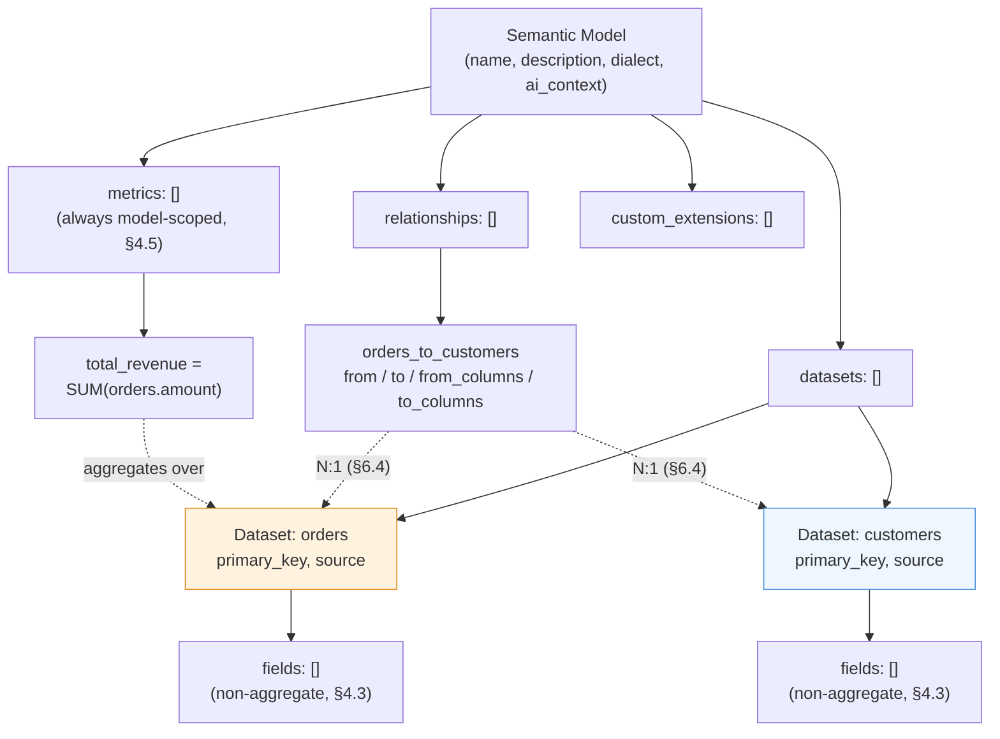
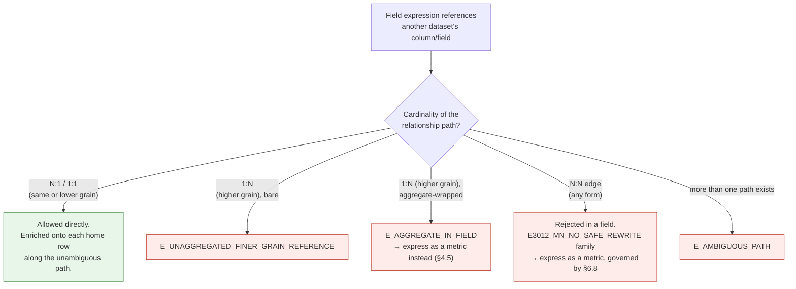
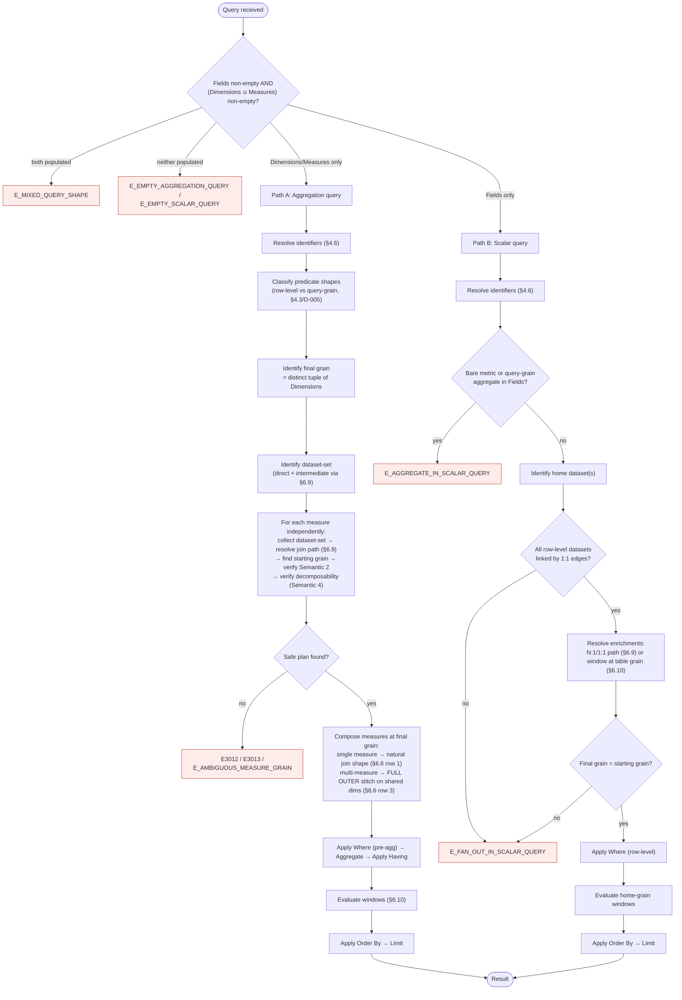
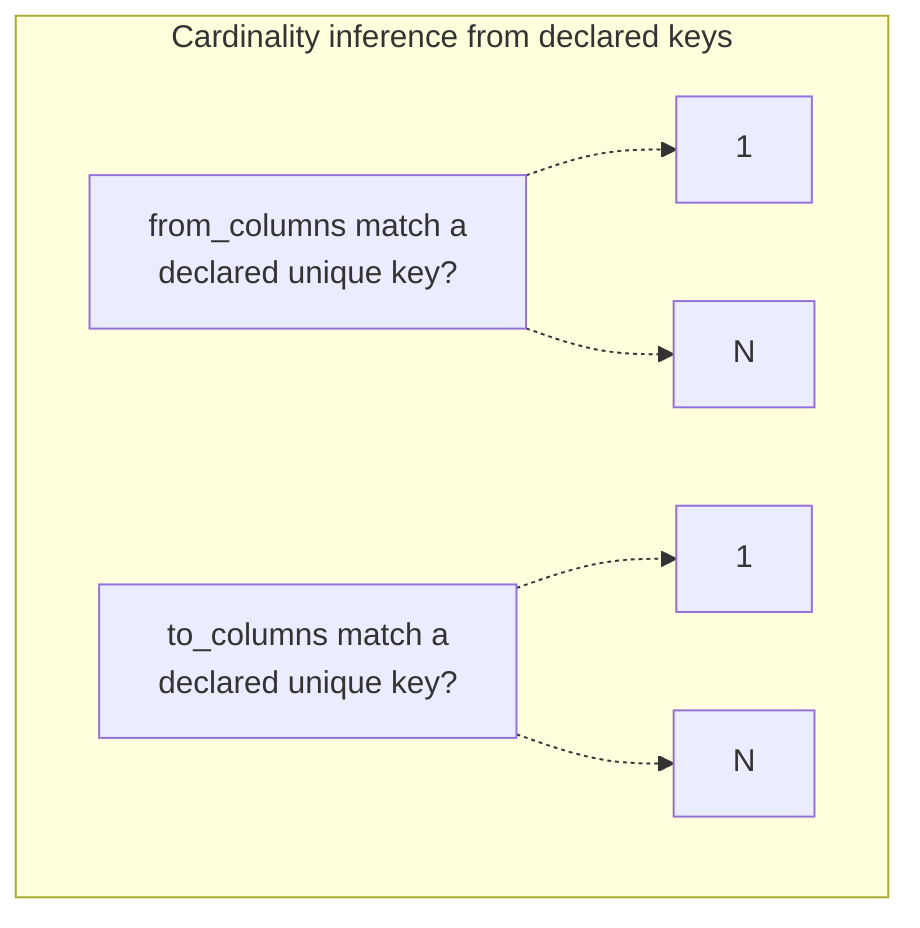
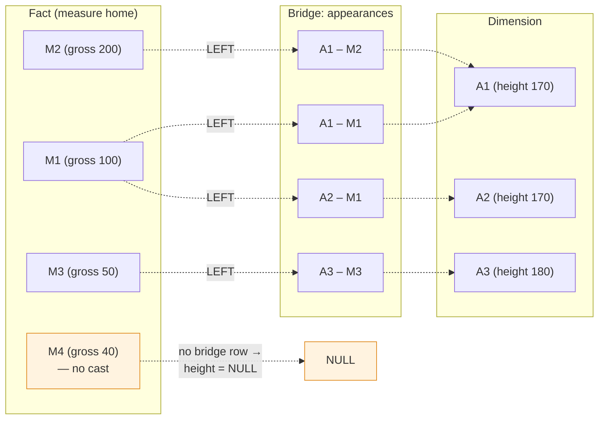
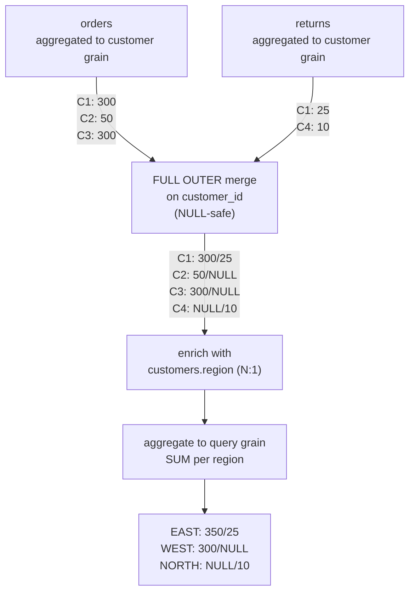

# Ossie Proposal: Foundational Semantics

**Working Group**

| Lead(s) | Participants |
|---|---|
| Will Pugh, Snowflake<br>Khushboo Bhatia, Snowflake | Lloyd Tabb, Malloy<br>Dianne Wood, AtScale<br>Lior Ebel, Salesforce<br>Quigley Malcolm, dbt Labs<br>Kurt, RelationalAI<br>Justin Talbot, Databricks<br>Pavel Tiunov, Cube<br>Damian Waldron, ThoughtSpot<br>Oliver Laslett, Lightdash<br>Martin Traverso, Starburst<br>JB Onofré, The ASF<br>Raul Beiroa, Denodo<br>Jakub Sterba, [GoodData.AI](http://gooddata.ai)<br>Thomas Nhan, Tableau (Salesforce)<br>Pratik Jain, Kyvos Insights |

**Related specs:**

- [Ossie Core Specification](./spec.md)
- [Ossie Proposal: Expression Language](./expression_language.md)

## Table of Contents

- [1. Motivation and Scope](#1-motivation-and-scope)
- [2. Design Principles](#2-design-principles)
- [3. What is In / What is Out](#3-what-is-in-what-is-out)
- [4. Semantic Model](#4-semantic-model)
  - [4.1 Top-Level Structure](#41-top-level-structure)
  - [4.2 Datasets](#42-datasets)
    - [4.2.1 Grain](#421-grain)
  - [4.3 Fields](#43-fields)
    - [4.3.1 Cross-dataset references in field expressions](#431-cross-dataset-references-in-field-expressions)
  - [4.4 Relationships](#44-relationships)
  - [4.5 Metrics](#45-metrics)
  - [4.6 Namespacing and Identifiers](#46-namespacing-and-identifiers)
    - [4.6.1 Identifier Form](#461-identifier-form)
    - [4.6.2 Reserved Names](#462-reserved-names)
    - [4.6.3 Scopes](#463-scopes)
    - [4.6.4 Reference Syntax](#464-reference-syntax)
- [5. Query Model](#5-query-model)
  - [5.1 Semantic Query Clauses](#51-semantic-query-clauses)
    - [5.1.1 Aggregation Query](#511-aggregation-query)
    - [5.1.2 Scalar Query](#512-scalar-query)
- [6. Semantics](#6-semantics)
  - [6.1 User-Visible Semantics](#61-user-visible-semantics)
    - [Semantic 1 — No fact row is silently dropped](#semantic-1-no-fact-row-is-silently-dropped)
    - [Semantic 2 — No row is double-counted by fan-out](#semantic-2-no-row-is-double-counted-by-fan-out)
    - [Semantic 3 — In multi-fact queries, no fact loses its groups](#semantic-3-in-multi-fact-queries-no-fact-loses-its-groups)
    - [Semantic 4 — No unsafe re-aggregations](#semantic-4-no-unsafe-re-aggregations)
    - [Semantic 5 — No silently wrong answer](#semantic-5-no-silently-wrong-answer)
  - [6.2 Evaluation Semantics](#62-evaluation-semantics)
    - [Starting Grain](#starting-grain)
    - [Final Grain](#final-grain)
    - [Determining Datasets Involved In a Query](#determining-datasets-involved-in-a-query)
    - [Normative Evaluation Algorithm](#normative-evaluation-algorithm)
  - [6.3 Having vs Where](#63-having-vs-where)
  - [6.4 Cardinality Inference](#64-cardinality-inference)
  - [6.5 Join Contexts](#65-join-contexts)
  - [6.6 Default Join Types](#66-default-join-types)
  - [6.7 Avoiding Traps](#67-avoiding-traps)
  - [6.8 M:N Resolution](#68-mn-resolution)
    - [6.8.1 Bridge Datasets (reference rewrite)](#681-bridge-datasets-reference-rewrite)
    - [6.8.2 Stitching Dimensions (reference rewrite)](#682-stitching-dimensions-reference-rewrite)
  - [6.9 Path Resolution and Ambiguity](#69-path-resolution-and-ambiguity)
  - [6.10 Window Functions](#610-window-functions)
    - [6.10.1 Where windows MAY appear](#6101-where-windows-may-appear)
    - [6.10.2 Determinism contract](#6102-determinism-contract)
    - [6.10.3 Fan-out and Semantic 2](#6103-fan-out-and-semantic-2)
    - [6.10.4 Grain interaction](#6104-grain-interaction)
    - [6.10.5 Windowed metrics in composition](#6105-windowed-metrics-in-composition)
    - [6.10.6 Frame modes](#6106-frame-modes)
  - [6.11 Empty-input and NULL-input aggregate behaviour](#611-empty-input-and-null-input-aggregate-behaviour)
    - [6.11.1 Empty-input behaviour](#6111-empty-input-behaviour)
    - [6.11.2 NULL-input behaviour (normative)](#6112-null-input-behaviour-normative)
    - [6.11.3 COUNT(DISTINCT) over N : N is safe](#6113-countdistinct-over-n-n-is-safe)
    - [6.11.4 Composition](#6114-composition)
    - [6.11.5 Multi-fact stitch](#6115-multi-fact-stitch)
- [7. SQL Expression Subset](#7-sql-expression-subset)
- [Appendix A: Error Code Index](#appendix-a-error-code-index)

## 1. Motivation and Scope

This proposal defines an initial set of semantics for Ossie that allows us to create an initial core base that we can use to build later abstractions on top of. It is consistent with the core abstractions, but holds off on APIs around grain and filter control. Standard SQL window functions are in scope (§6.10); only the genuinely non-portable extensions to windows — parameterized frame bounds, GROUPS frame mode, ordered-set aggregates with WITHIN GROUP, and windowed-metric composition — are deferred. These deferred features are powerful, and many BI tools have them, but with different design decisions for how they should work.

This will focus on:

1. **Core Ossie semantics** — datasets, fields, relationships, metrics, and a minimal query model, without grain overrides or filter-context propagation.
2. **Well-defined join semantics** — how relationships are declared, how cardinality is inferred, how the planner picks join types per context, and what safety rules prevent silent incorrectness.
3. **A fixed SQL subset** — the expression language allowed inside metric, field, and filter expressions, so that portable implementations can be written and two tools can agree on what a metric means.

Anything that falls outside these is explicitly deferred. §3 lists some deferred features.

## 2. Design Principles

1. **Portable first.** Every construct in this proposal must be representable in ANSI SQL:2003.
2. **Safe by default.** Where SQL would silently produce wrong results (fan-out, chasm trap), Ossie either disallows the operation or substitutes a safe rewrite. No query should compute a wrong answer because the author did not add a guard.
3. **Additive extension path.** Every feature deferred to §10 is additive: adopting it does not require reworking anything in this initial base. A model that uses only this base remains valid under the full spec.
4. **Declare intent, not execution.** Model authors describe *what* their data means (cardinality, referential integrity, relationship). The planner decides *how* to execute (join type, CTE structure, rollup order).
5. **Trust-but-don't-validate.** Ossie trusts declared primary keys, unique keys, and referential integrity. Data-quality enforcement is upstream (ETL, dbt tests, etc.), not a semantic-layer concern.

## 3. What is In / What is Out

The Foundation surface is deliberately narrow — several important features are pushed out, in order to focus on the foundational semantics first.

| In (Foundation v0.1) | Out (deferred to later proposals) |
|---|---|
| Datasets, fields, metrics, relationships (§4) | Aggregate-bodied fields and dataset-namespaced metrics (§4.3, §4.5; `E_AGGREGATE_IN_FIELD`, `E_DEFERRED_KEY_REJECTED`) |
| Aggregation and Scalar query shapes — Dimensions, Measures, Fields, Where, Having, Order By, Limit (§5.1) | Per-metric / per-dataset / per-model filter context (filter inheritance, named filters, CALCULATE-style overrides) |
| Equijoin relationships, single-column or composite (§4.4) | Rich join semantics — non-equijoin, ASOF, range (§10) |
| Cardinality **inferred** from declared primary / unique keys (§6.4) | Cardinality and referential integrity **declared** on relationships (`referential_integrity`, `from_all_rows_match`, `to_all_rows_match`) |
| Aggregate-before-join safety (§6.7) | Grain-based operations — explicit FIXED / INCLUDE / EXCLUDE / TABLE overrides (LOD equivalents) |
| Chasm-trap safety (independent fact computation + join on shared dims) (§6.7, §6.8.2) | Nested aggregation in metric expressions (`AVG(AVG(...))`, `AVG(COUNT(...))`; `E_NESTED_AGGREGATION_DEFERRED`) |
| Fan-out safety (§6.7, §6.10.3, §5.1.2) | Variables / parameters in queries or models |
| M:N traversal with a safe-result guarantee — bridge de-duplication (§6.8.1) and stitching dimensions (§6.8.2); every aggregate category accepted bare, no fan-out, no chasm | Path disambiguation (per-metric `using_relationships`, per-metric `joins.type` overrides) — ambiguous paths are surfaced as `E_AMBIGUOUS_PATH`, not silently picked |
| SQL expression subset — core scalar and aggregation functions, plus `COUNT(DISTINCT)` over a bridge (§7, [expression_language.md](https://github.com/apache/ossie/blob/main/core-spec/expression_language.md)) | Hierarchies (rollup paths, parent-child models) |
| Standard SQL window functions — ranking, navigation, aggregate-windows; ROWS / RANGE frame modes; integer-literal frame bounds (§6.10) | Non-portable window features — GROUPS frame, parameterised frame bounds, WITHIN GROUP ordered-set aggregates, windowed-metric composition |

A complete deferred-features registry, with one row per future proposal, is in §10.

## 4. Semantic Model

### 4.1 Top-Level Structure

The top-level structure is exactly the one defined in the [Ossie Core Specification](https://github.com/apache/ossie/blob/main/core-spec/spec.md) §"Semantic Model" — `name`, `description`, `dialect`, `ai_context`, `datasets`, `relationships`, `metrics`, and `custom_extensions`. The Foundation introduces no additional top-level keys.



### 4.2 Datasets

A dataset is a logical table backed by a physical SQL source.

| Field | Type | Required | Description |
|---|---|---|---|
| `name` | string | Yes | Unique within the model |
| `source` | string | Yes | `database.schema.table` or a SQL subquery |
| `primary_key` | array | No | Columns that uniquely identify rows |
| `unique_keys` | array of arrays | No | Additional unique constraints |
| `description` | string | No | |
| `ai_context` | string / object | No | |
| `fields` | array | No | See §4.3 |
| `custom_extensions` | array | No | vendor specific attributes |

**Primary and unique keys are semantic assertions about row uniqueness.** They feed cardinality inference for relationships (§6.4). Models that omit them remain valid: the engine MUST still produce correct, safe results, but it has to assume worst-case cardinality (N : N) and may emit more conservative SQL — possibly less efficient, never less correct.

Implementations MAY decide to require `primary_key` declarations in order to have a well-defined table grain. In that case, they MUST reject models that omit primary keys with `E_PRIMARY_KEY_REQUIRED`.

Engines SHOULD trust the keys defined in the dataset, and do not have to validate uniqueness beyond what is specified in the model.

```yaml
datasets:
  - name: orders
    source: sales.public.orders
    primary_key: [order_id]
    unique_keys:
      - [order_number]
    fields: [ ... ]
  - name: customers
    source: sales.public.customers
    primary_key: [id]
    fields: [ ... ]
```

#### 4.2.1 Grain

Grain is defined as the set of fields that uniquely define a row.

For a Dataset, we will use the term **Table Grain** (also: **home grain**) to denote the grain the dataset naturally lives at — its primary key (or any declared unique key). If a Dataset does not have a key, there is no way to uniquely identify a row.

> *Note on terminology.* Some BI traditions use the phrase "natural grain" for the same per-dataset concept. The Foundation deliberately avoids that wording because a deferred proposal uses `natural_grain` as a reserved model-level declaration that sets the table grain for the entire model. To prevent confusion this spec uses "table grain" exclusively for the per-dataset concept.

Grain for an aggregated query is the set of dimension fields in the query (or subquery).

For example, in the datasets defined above the grain of orders would be `order_id` and/or `order_number`.

For aggregation queries (or sub-queries) the grain will be the dimensions (`group by`) fields. For example, the grain of

```sql
SELECT order_location, COUNT(order_id)
FROM orders
GROUP BY 1
```

is `order_location`, because after the aggregation we know that `order_location` uniquely defines a row.

### 4.3 Fields

Fields are named expressions on a dataset. A field's expression is either a scalar (row-level) expression, a window function evaluated at the table grain, or a boolean form of either. **Aggregate expressions in fields are not part of the Foundation** — every aggregate is a metric (§4.5), and metrics live at the top-level `metrics:` section only. The shape of the expression — not a declared tag — determines how a reference to the field is routed in a query. Expansion of metrics onto fields will be handled in follow-up proposals.

> **Uses existing [Ossie Core Specification](https://github.com/apache/ossie/blob/main/core-spec/spec.md) §Fields, with behaviour extension.** The core spec says field expressions are *"scalar SQL expressions (no aggregations)"*. The Foundation upholds that rule with one extension: a field's expression MAY also include a standard SQL window function evaluated at the table grain (§6.10). Aggregate-bodied fields, including aggregates over the home dataset's own columns, are deferred to §10 along with all other dataset-namespaced metric forms — write the aggregate at the top-level `metrics:` section instead. A field expression that contains any aggregate function MUST raise `E_AGGREGATE_IN_FIELD`.

| Field | Type | Required | Description |
|---|---|---|---|
| `name` | string | Yes | Unique within the dataset |
| `expression` | string \| object | Yes | A non-aggregate SQL expression in the Ossie expression subset (§7). The schema for `expression` (string form and structured per-dialect form) is defined normatively in the [Ossie Core Specification](https://github.com/apache/ossie/blob/main/core-spec/spec.md) §"Fields" and the [Ossie Expression Language](https://github.com/apache/ossie/blob/main/core-spec/expression_language.md) proposal. |
| `description` | string | No | |
| `ai_context` | string / object | No | Synonyms, examples |
| `access_modifier` | enum | No | `public` (default) or `private` (hide from query) |

**Expressions** are tied to a dialect and to the table grain of the dataset they are attached to. They evaluate to one scalar value per home-dataset row (or one window-frame result per row).

Cross-dataset references inside a field's expression are governed by the grain rules in §4.3.1.

#### 4.3.1 Cross-dataset references in field expressions

This subsection governs what a field's expression may reference across relationships. The rule is restrictive on purpose: any aggregation packaged as a *field* (whether cross-grain or same-grain) would carry an implicit "this resolves at the table grain" pin, and the semantics of such a construct under a query-level Where clause is exactly the choice the grain proposal is meant to settle explicitly. The Foundation defers all field-level aggregation rather than picking a default that might be overturned; aggregations are expressed as model-scoped metrics (§4.5).

**Behaviour by cardinality.** When a field's expression references columns or fields from a related dataset, the routing depends on the cardinality of the relationship path from the field's home dataset to the referenced dataset:

- **Same or lower granularity** (referenced dataset is reachable via N : 1 / 1 : 1 edges from the home dataset): the reference is allowed directly and is enriched onto each row of the home dataset along the unambiguous path. Path-disambiguation is deferred (§10), so engines MUST raise `E_AMBIGUOUS_PATH` when more than one path exists.
- **Higher granularity** (referenced dataset is reachable via 1 : N edges): a non-aggregate reference at higher grain raises `E_UNAGGREGATED_FINER_GRAIN_REFERENCE` (D-024). An aggregate-wrapped reference (the cross-grain aggregation form) is rejected by the broader "no aggregates in field expressions" rule above (`E_AGGREGATE_IN_FIELD`). Express the aggregation as a model-scoped metric (§4.5) instead — e.g. `metrics: [{name: lifetime_value, expression: SUM(orders.amount)}]` — and consume it via an aggregation query.
- **Across an N : N edge** in a non-aggregating context: rejected (`E3012_MN_NO_SAFE_REWRITE`, §6.8). Cross-grain aggregation across an N : N edge is also handled by the rule above — packaged as a metric and governed by §6.8 the same way it is for any top-level metric.



**Window functions in field expressions.** A field's expression MAY include a standard SQL window function (e.g., `ROW_NUMBER() OVER (PARTITION BY customer_id ORDER BY order_date NULLS LAST)`). The window evaluates at the home dataset's grain; the window's `PARTITION BY` and `ORDER BY` expressions MUST be resolvable at that grain (row-level fields of the home dataset, or N : 1 enrichments along an unambiguous path). The Foundation's full window-function contract is in §6.10. (A window function is not an aggregate function in the spec sense — it does not raise `E_AGGREGATE_IN_FIELD`.)

**Worked example — aggregation expressed as a model-scoped metric, not a field.** The "sum of each customer's orders" pattern goes under top-level `metrics:`, not on the dataset:

```yaml
datasets:
  - name: customers
    primary_key: [id]
    fields:
      - { name: id, expression: id }
      - { name: region, expression: region }
  - name: orders
    primary_key: [order_id]
    fields:
      - { name: customer_id, expression: customer_id }
      - { name: amount, expression: amount }

relationships:
  - { name: orders_to_customer, from: orders, to: customers,
      from_columns: [customer_id], to_columns: [id] } # N:1

# All metrics --- including same-grain aggregates over a single dataset --- live in
# the top-level `metrics:` section. Field expressions are non-aggregate.
metrics:
  - name: lifetime_value
    expression: SUM(orders.amount) # resolves at the query's grain (§4.5)
```

The query `Dimensions: [customers.region]; Measures: [lifetime_value]` returns one row per region with the sum of order amounts — the standard cross-grain pattern.

If a `SUM(orders.amount)` (or any other aggregate, including the same-grain `SUM(amount)` on the orders dataset itself) were placed under `fields:`, the engine MUST raise `E_AGGREGATE_IN_FIELD`. Boolean cross-grain expressions such as `COUNT(orders.order_id) > 0` are also expressed as metrics and consumed in Having; the field-level form is deferred to §10's grain-aware functions or to the deferred §6.8 semi-join filter form.

```yaml
fields:
  - name: order_id
    expression: order_id
  - name: order_date
    expression: o_orderdate
    data_type: DATE # temporal semantics come from the SQL type
  - name: discounted_price
    expression: extended_price * (1 - discount)
  - name: full_name
    expression: first_name || ' ' || last_name
  - name: is_completed
    expression: status = 'completed' # boolean scalar → usable in Where
  - name: order_rank
    expression: ROW_NUMBER() OVER (PARTITION BY customer_id ORDER BY order_date NULLS LAST)
    # window function at table grain → usable in Where, Fields, etc.
```

### 4.4 Relationships

Relationships declare how datasets join. The Foundation supports **equijoin relationships only** (single-column or composite). Non-equijoin and temporal joins are deferred to the Non-Equijoin and ASOF proposals (§10).

| Field | Type | Required | Description |
|---|---|---|---|
| `name` | string | Yes | Unique within the model |
| `from` | string | Yes | The many-side dataset (FK side) |
| `to` | string | Yes | The one-side dataset (PK/UK side) |
| `from_columns` | array | Yes | FK columns |
| `to_columns` | array | Yes | PK or UK columns on the `to` side |
| `description` | string | No | |
| `ai_context` | string / object | No | |

Column arrays must have the same length and positionally correspond.

```yaml
relationships:
  - name: orders_to_customers
    from: orders
    to: customers
    from_columns: [customer_id]
    to_columns: [id]
  - name: line_items_to_orders
    from: line_items
    to: orders
    from_columns: [order_id]
    to_columns: [order_id]
  - name: order_lines_to_products
    from: order_lines
    to: products
    from_columns: [product_id, variant_id]
    to_columns: [id, variant_id]
```

Referential-integrity declarations on relationships (e.g., "every `from` row has a matching `to` row") are deferred to a companion proposal (§10). The Foundation always uses the safe defaults of §6.6 — LEFT for enrichment, FULL OUTER for multi-fact composition — and never silently drops rows because RI was assumed.

### 4.5 Metrics

Metrics are aggregate expressions. **All metrics are model-scoped — defined at the top level in the `metrics:` section and referenced by bare name.** The Foundation has exactly one place a metric can live and exactly one syntax for referencing it. Every aggregate expression is a metric; field expressions never contain aggregates (§4.3).

> **Deferred — dataset-namespaced aggregations.** Adding aggregations at the dataset level is deferred. This includes: (a) aggregate-bodied fields in a dataset's `fields:` list (e.g., `orders.fields: [{name: total_revenue, expression: SUM(amount)}]`), and (b) per-dataset `metrics:` blocks (e.g., `customers.metrics: [...]`).

| Field | Type | Required | Description |
|---|---|---|---|
| `name` | string | Yes | Unique in the global metric namespace |
| `expression` | string \| object | Yes | An aggregate SQL expression in the Ossie expression subset (§7). Schema (string form and structured per-dialect form) defined in the [Ossie Core Specification](https://github.com/apache/ossie/blob/main/core-spec/spec.md) §"Metrics" and the [Ossie Expression Language](https://github.com/apache/ossie/blob/main/core-spec/expression_language.md) proposal. |
| `description` | string | No | |
| `ai_context` | string / object | No | |
| `access_modifier` | enum | No | `public` (default) or `private` |

**Foundation rules for metric expressions.** A metric's expression MUST be one of:

1. **A single aggregation** that resolves at the query's grain (§6.2). The aggregate operates over scalars from any dataset reachable through the relationship graph — same-grain (`SUM(orders.amount)` when consumed at the orders grain), N : 1 / 1 : 1-reachable, or 1 : N-reachable (cross-grain single-step). Examples: `total_revenue = SUM(orders.amount)`, `total_orders = SUM(orders.amount)` (consumed at customer grain), `avg_order = AVG(orders.amount)` (cross-grain via the relationship graph).

   > **Cross-grain single-step semantics.** When the aggregate references a higher-grain dataset via a 1 : N edge, the single-step interpretation is **standard SQL semantics**: the engine joins the higher-grain rows through the relationship path and aggregates them at the query's grain. Each higher-grain row contributes once per output group, so Semantic 2 holds (§6.1). This is the same shape Looker, Tableau, and dbt-semantic-layer produce for cross-grain measures.
   >
   > **M : N cross-grain references.** Cross-grain aggregates over an N : N edge are accepted for every aggregate category (distributive, algebraic, holistic). The contract is set-theoretic: the aggregate's input is the set of unique (measure-home-row, group-key) associations reachable through the relationship path, plus one (measure-home-row, NULL) association for every measure-home-row that has no reachable group-key at all — the same NULL-bucketing Semantic 1 (§6.1) requires for a plain broken foreign key, applied to the M:N case. A measure-home-row is never simply absent from the input set; if it has no path to a group-key, it is present with a NULL one. Its output is the result of applying the aggregate to that set, once per group. Engines MAY implement this contract by any plan that produces equivalent results; the reference construction is in §6.8.1 (D-026, D-027). For `AVG(movies.gross)` grouped by `actors.height` over actors ↔ appearances ↔ movies (the §6.8.1 fixture), the required answer is 170 → AVG(100, 200) = 150, 180 → AVG(50) = 50. This is the heavy-side-weighted single-step analogue of the 1 : N rule above. The alternative "per-home-row-first" interpretation (e.g., per-actor-first averaging, which would yield 125 for height 170) is the *nested* form `AVG(AVG(movies.gross))` and is **deferred** to §10's grain-aware-functions proposal (see below).

2. **An arithmetic combination** of already-defined metrics, scalar literals, and aggregated scalar expressions: `m1 / NULLIF(m2, 0) * 100`, `revenue - cost`. Each operand resolves independently at the query's grain per §6.2; the arithmetic is applied after the operand aggregates have resolved. Bare row-level fields finer than the query's grain MUST be inside an aggregate; an unwrapped finer-grain reference MUST raise `E_UNAGGREGATED_FINER_GRAIN_REFERENCE` (D-024). Bare fields at coarser grain than the query's grain (constants, header fields on an N : 1-reachable dataset, etc.) attach via §4.3 and are usable directly.

3. **A metric reference** (`total_revenue`) — an alias or rename of an existing metric, resolved at the query's grain per §6.2.

4. **A window-function expression** that resolves at the query's grain — see §6.10 below.

> **Deferred — nested aggregation.** Expressions of the form `OUTER(INNER(<expr>))` where INNER is an aggregate (e.g., `AVG(COUNT(orders.oid))`, `AVG(AVG(orders.amount))`) MUST raise `E_NESTED_AGGREGATION_DEFERRED`. The per-home-row-first interpretation that nested aggregation expresses requires an implicit grain pin on the inner aggregate, and the rules for choosing that pin (which dataset, how Dimensions participates) are deferred to §10's grain-aware-functions proposal. Practical implications:

- For **distributive** aggregates (SUM, COUNT, MIN, MAX), the single-step form gives identical numbers to the nested form, so there is no expressive loss — write `SUM(orders.amount)` instead of `SUM(SUM(orders.amount))`.
- For **non-distributive** aggregates (AVG, STDDEV, VARIANCE, MEDIAN, PERCENTILE) over a 1 : N edge, only the heavy-side-weighted single-step interpretation is available today (`AVG(orders.amount)` is the average over every order, not the average of per-customer averages). The unweighted "average of per-home-row averages" interpretation waits for §10.
- For **non-distributive** aggregates over an N : N edge, the bare single-step form is **accepted** under the bridge-de-duplication construction of §6.8.1 (the analogue of the heavy-side-weighted 1 : N rule above). Only the per-home-row-first interpretation — written as the nested form `AVG(AVG(...))` — waits for §10. `AVG(movies.gross)` by `actors.height` ⇒ accepted (bridge-dedup AVG); `AVG(AVG(movies.gross))` by `actors.height` ⇒ `E_NESTED_AGGREGATION_DEFERRED`.

**Filter and grain context.** Metric-references-metric (forms 2 and 3) introduce **no per-metric grain override** and **no per-metric filter override**. Every referenced operand resolves at the query's grain per §6.2 and is filtered by the query's Where clause like any other aggregate in the projection — that is standard SQL behaviour, not a Foundation extension. Per-metric grain controls (Tableau FIXED / INCLUDE / EXCLUDE) and per-metric filter overrides (Tableau FIXED filters, Power BI CALCULATE, dbt-semantic-layer metric filters) — which let an individual metric ignore or replace the surrounding query context — are deferred to §10.

**Window functions in metric expressions.** A metric's expression MAY contain a standard SQL window function (e.g., `running_total = SUM(amount) OVER (ORDER BY order_date NULLS LAST)`). The window evaluates at the query's grain over the post-GROUP BY row set. The Foundation's full window-function contract is in §6.10. One limitation: a metric expression that itself **references** another metric whose expression contains a window function is deferred (§10, §6.10.5) — direct use of a windowed metric in Measures works today, but composing windowed metrics through forms (2) and (3) does not.

These rules produce numerical results equivalent to Looker, Tableau, and dbt-semantic-layer's cross-grain handling for 1:N reaches with single-step aggregation. Snowflake Semantic Views require explicit nested form for cross-grain aggregates; with nested aggregation deferred in the Foundation, only the single-step form is available — see §12.A for the divergence note.

```yaml
datasets:
  - name: orders
    fields:
      - { name: order_id, expression: order_id }
      - { name: customer_id, expression: customer_id }
      - { name: amount, expression: amount }
      - { name: discount, expression: discount }
    # No `metrics:` block on a dataset --- that form is deferred (see §4.5).

# All metrics live here, referenced by bare name.
metrics:
  # Same-grain aggregate over a single dataset.
  - name: total_revenue
    expression: SUM(orders.amount)
  - name: order_count
    expression: COUNT(orders.order_id)
  - name: distinct_customers
    expression: COUNT(DISTINCT orders.customer_id)

  # Derived metric --- arithmetic of other metrics.
  - name: avg_order_value
    expression: total_revenue / NULLIF(order_count, 0)

  # Multi-column aggregate over a single dataset's own columns.
  - name: net_revenue
    expression: SUM(orders.amount * (1 - orders.discount))

  # Cross-grain single-step (form 1) --- standard SQL semantics.
  # Each order row contributes once per output group; SUM is distributive.
  # When consumed at customer.region grain, this is the per-region revenue total.
  - name: customer_revenue
    expression: SUM(orders.amount)

  # Cross-grain single-step AVG --- also accepted; standard SQL semantics.
  # Grouped by region, this is the average over every order whose customer
  # is in that region --- a heavy-customer-weighted average. The unweighted
  # "average of per-customer averages" form is deferred (see §4.5 deferral above).
  - name: avg_order_amount_across_customers
    expression: AVG(orders.amount)
```

### 4.6 Namespacing and Identifiers

This section is normative for the Foundation surface. The identifier *grammar* and case equivalence lives in the [Ossie Expression Language](./expression_language.md) proposal.  This section defines the semantics for identifier resolution.

#### 4.6.1 Identifier Form

The identifier form allows for a multipart definition, that can include scopes.  For example `cost` and `part_order.cost` are both valid identifiers in Ossie.  In order to match this to an object in the semantic definition, we need to know which scope to look in.

When, and identifier is singlepart, the scope is implied by where the expression is created.  E.g. if it is in a global metric, then it is global.  If it is in a dataset's field.  It is scoped to that dataset.

When an identifier is multipart, the section before the `.` will help determine the scope.  It will match from the global scope to find the parent object and the parts will be used to refine from that.  E.g. `part_order.cost` will look for a dataset named `part_order` and find the `cost` field on it.

#### 4.6.2 Reserved Names

The Foundation reserves the following names. Engines MUST reject user-defined identifiers that collide with them:

| Reserved | Meaning |
|---|---|
| `GRAIN` | Reserved for the deferred grain extension (§10). |
| `FILTER` | Reserved for the deferred filter-context extension (§10); also reserved by SQL window-function syntax. |
| `QUERY_FILTER` | Reserved for the deferred filter-context extension (§10). |

ANSI SQL reserved words are also reserved at the identifier level — engines MAY accept them only when quoted.

#### 4.6.3 Scopes

The three-scope model (Global / Dataset / Physical) and the in-dataset precedence table (physical → logical-on-same-dataset → global) are defined in the [Ossie Expression Language](https://github.com/apache/ossie/blob/main/core-spec/expression_language.md) proposal §"Name Spaces". The Foundation adds the following:

**Global scope — Foundation-specific membership and rules.** In the Foundation, the only global names are **datasets**, **relationships**, and **model-scoped metrics**. All global names share one namespace: a dataset and a relationship cannot have the same normalised name; a metric and a relationship cannot have the same normalised name; etc. Engines MUST reject duplicate global names with `E_NAME_COLLISION`. A dataset-scoped field MAY share a normalised name with a global name — they live in different scopes; the in-dataset precedence table decides which one a bare reference picks up.

**Reach restrictions.** Global metric expressions can reference any other global name and any dataset-scoped name (qualified as `dataset.field`), but cannot reach physical columns directly — physical columns are reachable only from inside the dataset that owns them. Relationships MAY reference physical columns on either endpoint (per the Ossie Expression Language proposal).

**Practical consequence of the precedence table.** A dataset that declares both a physical column `id` and a logical field `id` resolves bare `id` to the physical column; the qualified form `<dataset>.id` reaches the logical field.

#### 4.6.4 Reference Syntax

Three rules cover every reference site:

1. **Inside a query** (Dimensions, Measures, Where, Having, Order By, Fields): the precedence is only to look at the global scope.  Therefore, and **bare name** will look for a global metric, and any dataset field MUST be qualitied with the global dataset name, e.g. `dataset.field`.

   Example: in `Measures: [total_revenue]`, the engine resolves `total_revenue` to the model-scoped metric of that name. If no metric `total_revenue` exists, the engine raises `E_NAME_NOT_FOUND`. In `Dimensions: [orders.region]`, `orders.region` resolves to the field `region` on dataset `orders`.

   The Foundation has no `dataset.metric_name` form (dataset-namespaced metrics are deferred per §4.5). Every metric lives in one global namespace, so name collisions across the model surface as ordinary `E_NAME_COLLISION` at validation time, not as scope-resolution ambiguities at query time.

2. **Inside a dataset field expression**: bare names follow the precedence of (physical → logical → global). If a global name is shadowed by a local logical field, then it is not accessible from within a dataset field.

3. **Inside a global-scoped metric expression**: the precedence acts the same as the query lookup.  It only looks at the global scope, so dataset local fields MUST be qualified to include the global dataset name, e.g. `dataset.field`. 

## 5. Query Model

### 5.1 Semantic Query Clauses

A semantic query is one of two distinct shapes. Every Foundation query MUST be classifiable as exactly one of them. The shape is determined by which projection clause the query uses.

| Shape | Projection clauses | Result grain | Maps to standard SQL... |
|---|---|---|---|
| **Aggregation query** | Dimensions and/or Measures | One row per distinct tuple of Dimensions. Empty Dimensions ⇒ exactly one row (the empty grain). | ...with a GROUP BY (or no GROUP BY and only aggregates in the SELECT list). |
| **Scalar query** | Fields | Table grain — one row per row in the (joined) source row set. No aggregation. | ...with no GROUP BY and no aggregates in the SELECT list. |

Mixing Fields with Dimensions or Measures in the same query is rejected (`E_MIXED_QUERY_SHAPE`). The two shapes have different correctness rules and different SQL contracts; the engine must know which one it is compiling before it plans.

##### Common clause semantics

The following rules apply to both query shapes. Per-shape clauses below extend them.

**Where and Having predicate lists.** Both clauses accept either a single predicate expression or a list of predicate expressions. A list MUST be interpreted as the conjunction (AND) of its entries. `Where: [P1, P2]` is identical in meaning to `Where: "P1 AND P2"`. Engines MAY support either surface form; conformant emitted SQL is the AND-joined form. There is no Foundation-level OR shortcut between list entries — OR must be written inside an expression.

**Order By NULL placement.** Every Order By entry — both the outer query's Order By and any ORDER BY inside an `OVER (...)` window clause — has a defined NULL placement. If the entry does not specify `NULLS FIRST` or `NULLS LAST` explicitly, the Foundation default is **ASC ⇒ NULLS LAST, DESC ⇒ NULLS FIRST** — i.e., NULL is treated as a *high-end* value that lands at whichever end of the sort the maximum lands at. The compiled SQL MUST guarantee this *resolved row order* on every supported dialect; engines achieve this by emitting the explicit `NULLS ...` clause whenever the dialect's native default would otherwise produce a different order. (When the resolved clause already matches the dialect's native default — e.g. `DESC NULLS FIRST` on Snowflake, `ASC NULLS LAST` on DuckDB — the explicit clause MAY be elided from the compiled SQL, since elision and explicit emission produce identical row orders on that dialect. The byte-identical-output guarantee in D-014 is per (model, query, dialect) — *within* a dialect the compiled SQL is deterministic; *across* dialects the row order is identical even when the literal SQL text differs by an elidable `NULLS ...` token.) The Foundation chooses the high-end-NULL convention because (a) it matches SQL:2003's "NULLs compare-greater than non-NULLs" default, and the out-of-the-box defaults of Snowflake, PostgreSQL, and Oracle; (b) it preserves the **symmetry property** that flipping ASC ↔ DESC also flips the NULL placement, which is the behaviour every common BI mental model assumes (e.g. "top 10 by revenue → flip to bottom 10" should bring the NULL-revenue rows to the top, since they *are* the worst values by any reasonable interpretation). A user who wants every NULL pinned to a specific end regardless of direction MUST write the explicit `NULLS FIRST` / `NULLS LAST` clause; the compiled SQL then carries that explicit clause on every dialect (it cannot be elided because it overrides the resolved default).

**Order By entry shape.** An Order By entry references either (a) a name that is in scope for the query's projection — a dimension name, a measure name (for an aggregation query), or a field name (for a scalar query) — or (b) any expression that would have been valid in the projection. Positional references (`ORDER BY 1`) are not part of the Foundation surface. Engines that compile to SQL MAY use positional references in emitted SQL if they preserve determinism.

**Limit without Order By.** A Limit without an Order By MUST be accepted and compiled — same as standard SQL. The resulting row set is engine-defined (which rows are kept is up to the engine and underlying storage), but the emitted SQL itself MUST be deterministic per D-014 — the same (model, query, dialect) produces byte-identical SQL on every compilation. Engines MAY emit a diagnostic for users who appear to want determinism, but are NOT required to. Users who need a stable row set MUST supply an Order By whose tuple is unique within the result.

**Result-column naming.** There is no cross-vendor convention for naming the result column produced by a `dataset.field` reference (Snowflake renders the full path expression; Databricks renders `parent.field`; Postgres/BigQuery render the leaf name only). The Foundation therefore does **not** mandate a particular result-column-naming scheme — engines MAY emit the leaf name (`region` for `orders.region`), the qualified name, the full path, or a vendor-specific form, as long as it is deterministic for the same (model, query, dialect). Metrics, which are referenced by bare name, do not have this ambiguity (the result column is the metric's name unless the user supplies an explicit alias). Users who need a stable, portable result-column name for a `dataset.field` reference MUST use an explicit alias (e.g., `Dimensions: [orders.region AS order_region]`). A future SQL-interface proposal (§9) is expected to settle this.

#### 5.1.1 Aggregation Query

| Clause | Purpose | Required |
|---|---|---|
| **Dimensions** | Fields used for grouping. Become the query's GROUP BY. | No* |
| **Measures** | Metrics, ad-hoc aggregations, or window expressions to compute. Window functions (§6.10) evaluate over the post-GROUP BY row set. | No* |
| **Where** | Pre-aggregation filter; predicates with no aggregate and no window (§6.3, §6.10.1). | No |
| **Having** | Post-aggregation filter; predicates whose top-level boolean references at least one aggregate or window (§6.3). | No |
| **Order By** | List of `{field-or-measure-or-window-expression, direction}` pairs. | No |
| **Limit** | Row limit on the result set. | No |

\*At least one of Dimensions or Measures MUST be non-empty.

**Result grain:** the distinct tuple of Dimensions. Empty Dimensions collapse to the **empty grain** — exactly one row containing the fully-aggregated measures.

**Example semantic query:**

```yaml
query:
  dimensions: [customers.market_segment, orders.order_year]
  measures: [total_revenue, order_count]
  where: "orders.status = 'completed' AND customers.region = 'WEST'"
  having: "total_revenue > 1000"
  order_by: [{field: total_revenue, direction: DESC}]
  limit: 50
```

**Standard SQL it corresponds to (any aggregation SELECT with a GROUP BY is an aggregation query):**

```sql
SELECT customers.market_segment,
       orders.order_year,
       SUM(orders.amount) AS total_revenue,
       COUNT(orders.order_id) AS order_count
FROM orders
LEFT JOIN customers ON orders.customer_id = customers.id
WHERE orders.status = 'completed' AND customers.region = 'WEST'
GROUP BY customers.market_segment, orders.order_year
HAVING SUM(orders.amount) > 1000
ORDER BY total_revenue DESC
LIMIT 50
```

A vendor-specific SQL surface (a `SEMANTIC_VIEW(...)` clause, a `FROM <semantic_view>` syntax, a SQL-runner over the model, etc.) MAY render the same semantic query differently. The Foundation does not mandate a particular SQL surface; §12 catalogs how existing vendor surfaces compare.

#### 5.1.2 Scalar Query

A scalar query asks for **table-grain rows** — one row per row in the home dataset, with no aggregation step at the query level.

| Clause | Purpose | Required |
|---|---|---|
| **Fields** | The columns to project. Each entry MUST be a scalar at the **home dataset's grain** — either a row-level field on the home dataset, an enrichment along an N : 1 path (§4.3), or a window function evaluated at the table grain (§6.10). | Yes |
| **Where** | Row-level filter; predicates with no aggregate and no window (§6.3, §6.10.1). Compiles to SQL WHERE. | No |
| **Order By** | List of `{field-or-window-expression, direction}` pairs. | No |
| **Limit** | Row limit on the result set. | No |

**Constraints:**

- Fields MUST contain at least one entry.
- No Measures, no Dimensions, no Having. Group-level predicates have no meaning at table grain.
- A **bare metric reference** in Fields (e.g., `revenue`) is rejected with `E_AGGREGATE_IN_SCALAR_QUERY`. A metric is an aggregation, not a per-home-row scalar; the user likely wants an aggregation query (§5.1.1). The error message MUST suggest converting to an aggregation query.
- A field whose expression contains **any aggregate** (same-grain over the home dataset's own columns or cross-grain via a 1 : N reach) is rejected at *model-validation* time with `E_AGGREGATE_IN_FIELD` (§4.3). All aggregates are model-scoped metrics (§4.5) and consumed via an aggregation query (§5.1.1); the field-level form is deferred to §10.
- Cross-dataset references in Fields follow §4.3: same/lower-grain references attach directly along an unambiguous N : 1 / 1 : 1 path. Higher-grain references are not allowed in Fields at all (an unwrapped finer-grain reference raises `E_UNAGGREGATED_FINER_GRAIN_REFERENCE`, D-024; an aggregate-wrapped reference inside a field expression raises `E_AGGREGATE_IN_FIELD`, §4.3).

**Result grain:** the **home dataset's table grain** — the row set produced by taking the home dataset's rows and enriching along N : 1 paths needed to resolve Fields. The home dataset is the dataset whose row-level (non-aggregated) fields drive the projection; if Fields references several datasets at the same grain (linked by 1 : 1 edges), the engine treats them as one logical home. The result is one row per surviving home-dataset row, after Where and Limit are applied.

**Multiple incompatible homes.** If Fields supplies row-level (non-aggregated) references from two or more datasets that are **not** linked by declared 1 : 1 edges — for example `Fields: [orders.amount, returns.amount, customers.region]`, with orders and returns as independent facts on the many-side of customers — there is no single table grain at which the scalar shape can produce one row per home-dataset row without replicating the other root's rows. The engine MUST raise `E_FAN_OUT_IN_SCALAR_QUERY` (D-023, extended). The diagnostic MUST identify the conflicting home datasets and suggest either converting to an aggregation query or choosing a single fact as the home. (A semi-join filter form is deferred — see §6.8.) This matches the row-level-projection semantics of every major BI tool: Tableau, Power BI matrices, and Looker explores all anchor row-level views on a single base table; Ossie follows the same convention.

**Example semantic query — pure row-level projection:**

```yaml
query:
  fields: [orders.order_id, orders.amount, customers.market_segment]
  where: "orders.status = 'completed'"
  order_by: [{field: orders.amount, direction: DESC}]
  limit: 100
```

**Standard SQL it corresponds to (any non-aggregating SELECT is a scalar query):**

```sql
SELECT orders.order_id,
       orders.amount,
       customers.market_segment
FROM orders
LEFT JOIN customers ON orders.customer_id = customers.id
WHERE orders.status = 'completed'
ORDER BY orders.amount DESC
LIMIT 100
```

**Cross-grain aggregation: use an aggregation query, not a scalar query.** A pattern such as "list each customer's region and lifetime value" is *not* a scalar query in the Foundation. Define the aggregation as a metric (§4.5 form 1) and consume it via an aggregation query (§5.1.1):

```yaml
# Model
metrics:
  - name: lifetime_value
    expression: SUM(orders.amount) # higher-grain reference inside a metric --- allowed

# Query (aggregation query, not scalar)
query:
  dimensions: [customers.region, customers.id]
  measures: [lifetime_value]
  order_by: [{field: lifetime_value, direction: DESC}]
  limit: 20
```

This returns one row per (region, customer) pair with the customer's lifetime value. Aggregate-bodied fields (any aggregate in a field expression, including the cross-grain pattern packaged as a field on customers) are deferred to §10's grain-aware-functions proposal — see §4.3.

The mapping rule for SQL surfaces: **a SQL SELECT with GROUP BY (or with query-level aggregates in the projection) is an aggregation query; a SQL SELECT with neither is a scalar query.** A user porting an existing SQL query to a semantic query keeps the same shape on each side.

Implementations MAY provide any surface syntax — JSON, SQL subclause, programmatic builder — as long as the semantic clauses above are expressible.

There is currently **no authoritative SQL surface** for Ossie; this is an area where a portable surface is still emerging. Multiple vendors offer SQL surfaces over their semantic layers, and a common convention is to map the presence of GROUP BY (or aggregates in the projection) to the aggregation-query shape and the absence of both to the scalar-query shape — which is exactly the rule above. A Foundation-compliant SQL surface that follows this convention will keep user intent stable across implementations.

## 6. Semantics

This is the heart of the Foundation. The goal is that two Ossie-compliant engines running the same query on the same data always get the same result.

### 6.1 User-Visible Semantics

When a query spans multiple datasets, Ossie's engine chooses the join shape for you using a small set of safety-first defaults. The rules you can rely on are the five **user-visible semantics** below. Every concrete rule in the rest of §6 — cardinality inference, default join types, trap avoidance, M:N resolution, path resolution — exists to make these five guarantees hold.

#### Semantic 1 — No fact row is silently dropped

If you query a fact and pull in dimension columns, **every fact row is represented in the result**. After grouping, fact rows whose dimension key doesn't match anything are aggregated into a NULL bucket on those dimensions — they do not silently disappear from totals.

A broken foreign key surfaces as a NULL bucket in the result, never as silently-missing rows. To opt into the alternative ("only orders with a known customer"), add `WHERE <dim_field> IS NOT NULL`.

Opt-in INNER-promotion via declared referential integrity is deferred to a later proposal (§10).

#### Semantic 2 — No row is double-counted by fan-out

**No row of dataset A contributes more than once to a measure defined on A**, regardless of what tables you join in for grouping or filtering. A customer with 5 orders is counted once in `COUNT(customers.id)`, not five times — even if the query also groups by an order-level dimension.

**A row of dataset A MAY contribute to more than one group** when the relationship between A and the grouping dimension is many-to-many (e.g., a bridge table). In that case, the engine MUST either:

- Ensure that each row of A contributes to each group at most once (the bridge / stitch resolutions of §6.8), or
- Fail the query with an error rather than silently inflating the totals.

This behaviour means that summing per-group totals over an M:N edge MAY give a number different from a total computed directly over the base table — that is fan-out *by design*, not double-counting.

#### Semantic 3 — In multi-fact queries, no fact loses its groups

When you put measures from two different facts in the same query (e.g., revenue from orders and returns from returns, both grouped by `customer.region`), **the result contains every group that appears in either fact**. A region with revenue but no returns appears with `returns = NULL` (or 0 if the metric coalesces). A region with returns but no orders also appears.

Pulling a second fact into your query never *removes* groups that were in your first fact's answer.

#### Semantic 4 — No unsafe re-aggregations

Aggregations fall into three main categories: distributive, algebraic, and holistic.

- **Distributive** functions like SUM can be re-aggregated with the same function (SUM of partial SUMs) and the distributive property guarantees the correct result.
- **Algebraic** functions like AVG can be broken into multi-step aggregations, but the intermediate step needs a different operation than the final one. For AVG, the engine tracks SUM and COUNT separately so the final division uses the right total. Taking the AVG of an AVG directly is unsafe — it overweights smaller populations.
- **Holistic** functions like percentile and `COUNT(DISTINCT)` need the entire population to compute the final answer and cannot be decomposed safely.

Implementations MUST NOT silently re-aggregate using an unsafe path. When the chosen plan forces multi-stage decomposition that the aggregate cannot survive — typically a holistic or unsupported-algebraic aggregate over a §6.7 chasm pre-aggregation or a §6.8.2 stitch — the engine MUST raise `E_UNSAFE_REAGGREGATION` and identify the aggregate and the grains involved. The §6.8.1 bridge plan does not force decomposition (it is a single-pass aggregate over the de-duplicated row set) and so is not in scope for this rule; every aggregate category resolves through it per D-027.

#### Semantic 5 — No silently wrong answer

If the engine cannot find a safe way to compute your query, it raises a typed error with a code, not a plausible-but-wrong number. Different engines may handle some M:N edge cases differently — one engine's safe rewrite is another's typed error — but neither is allowed to produce silently-inflated output.

The error codes you'll hit in practice:

| When | Error code |
|---|---|
| Two facts joined through an N : N relationship with no safe rewrite at the query's grain | `E3012_MN_NO_SAFE_REWRITE` |
| Two unrelated facts referenced together with no shared dimension | `E3013_NO_STITCHING_DIMENSION` |
| Multiple equally-valid join paths exist | `E_AMBIGUOUS_PATH` |
| No relationship path connects the referenced datasets | `E_NO_PATH` |
| The chosen plan forces multi-stage decomposition the aggregate cannot survive (holistic over chasm pre-agg or stitch) | `E_UNSAFE_REAGGREGATION` |
| A scalar-query join path replicates home-dataset rows | `E_FAN_OUT_IN_SCALAR_QUERY` |
| A row-level reference to a field at a grain finer than the consuming table grain | `E_UNAGGREGATED_FINER_GRAIN_REFERENCE` |

### 6.2 Evaluation Semantics

The evaluation depends on the query shape (§5.1) — whether it aggregates or not. The concepts below — starting grain, final grain, and the dataset set — are common to both shapes.

#### Starting Grain

The starting grain defines the pre-aggregation row set that the operation begins from. For an aggregation query, **each metric resolves its own starting grain independently** from the datasets its expression touches and the join path the engine resolves. Two metrics in the same query MAY have different starting grains; the engine combines them under the §6.1 semantics and the M:N rules in §6.8.

For a given metric, there may be multiple starting grains when shared dimensions or many-to-many joins are present. In most cases the engine can aggregate in a way that satisfies the §6.1 semantics — for example, by pre-aggregating fan-out-prone joins (§6.7) or by walking through a bridge dataset (§6.8.1). When it cannot, it MUST fail with a typed error rather than producing a silently-wrong number. The relevant codes, narrowest-first:

| Code | Condition |
|---|---|
| `E3012_MN_NO_SAFE_REWRITE` | The composition crosses an N : N edge with no available bridge or shared-dimension stitch (§6.8). (Semi-join filter form deferred — see §6.8 note.) |
| `E3013_NO_STITCHING_DIMENSION` | Two unrelated facts referenced in the same measure with no shared dimension and no relationship path. |
| `E_UNSAFE_REAGGREGATION` | The chosen plan **forces a multi-stage decomposition** that the aggregate cannot survive. The two Foundation shapes that force decomposition are §6.7 chasm pre-aggregation (multiple incompatible 1:N reaches that must be aggregated independently before being merged) and §6.8.2 stitch (independent per-fact aggregation under a shared dimension followed by a FULL OUTER merge, then re-aggregation at the query grain). A holistic aggregate (MEDIAN, PERCENTILE_CONT) cannot be decomposed across these stages; an algebraic aggregate (AVG, STDDEV) survives them only if the engine implements its multi-stage decomposition. The §6.8.1 bridge plan does **not** force decomposition — it is a single-pass aggregate over the de-duplicated (measure-home-row, group-key) set, so every aggregate category resolves there per D-027. The diagnostic MUST name the aggregate and the grains involved, and SHOULD suggest the safe rewrite (pre-aggregate at the table grain, switch to a distributive aggregate, or restate at a coarser grain). See §7 and the Ossie Expression Language proposal for the distributive / algebraic / holistic categories. |
| `E_AMBIGUOUS_MEASURE_GRAIN` | Catch-all: a single measure has multiple incompatible starting grains and none of the more-specific codes above applies. Foundation engines SHOULD reach for the more-specific codes first; this code is reserved for shapes the spec does not yet enumerate. The diagnostic MUST list the starting grains the engine identified. |

To find the starting grain for a metric, the engine:

1. **Finds all datasets** touched by any dimension, the measure being calculated, Where predicate, or Having predicate.
2. **Resolves a join path** — a connected sub-graph of the declared relationships that spans those datasets. If multiple paths exist, see §6.9.
3. **Follows the 1-side of joins to find the finest-grain dataset** in the path. If multiple incomparable finest-grain datasets exist (shared dim, M:N), each is treated as an independent starting point and the engine MUST combine them via §6.7 (pre-aggregation), §6.8.1 (bridge), or §6.8.2 (stitch), failing with one of the codes above if no safe combination exists.

If a finer-grained referenced field is **not wrapped in an aggregate** (i.e., the user is projecting a row-level value at a grain finer than the consuming grain), the query MUST fail with `E_UNAGGREGATED_FINER_GRAIN_REFERENCE`. The remedy is to wrap the reference in an aggregate (SUM, COUNT, etc.) or pull the value from a coarser-grain related dataset where it is already at the table grain.

> **Out of scope: model-level `natural_grain` declaration.** A separate proposal — *Ossie Proposal: Natural Grain* (not yet committed to `core-spec/`; tracked on the [roadmap](https://github.com/apache/ossie/blob/main/ROADMAP.md)) — defines an optional top-level `natural_grain:` key that pins one dataset as the implicit anchor for every query against the model. The Foundation does NOT adopt that feature yet. The behaviour described above (each metric resolves its own starting grain) is what the Foundation guarantees.

#### Final Grain

The final grain of a query is what defines a unique row in the result.

In an aggregation query, the final grain is the grain implied by the dimensions. If there are no dimensions, the final grain is the empty set — a total aggregation to a single row.

In a scalar query, the final grain MUST be the same as the starting grain (there is no aggregation step between them). If that is not possible — because the join path the query forces through includes an N : N edge or any other join that replicates the home dataset's rows — the query MUST fail with `E_FAN_OUT_IN_SCALAR_QUERY`. (The aggregation-query shape handles the same condition non-fatally by pre-aggregating on the many-side per §6.7; only the scalar shape lacks an aggregation step in which to absorb the fan-out, so the same condition is fatal there.)

#### Determining Datasets Involved In a Query

The datasets involved in a query are:

1. Every dataset directly referenced by Dimensions, Measures, Where, Having, Order By, or Fields, **plus**
2. Every **intermediate dataset** required to resolve a connecting join path between the directly-referenced datasets via the relationships graph (§6.9).

A query for `Dimensions: [region.name]; Measures: [SUM(orders.amount)]` over a model with `orders → customers → region` directly references orders and region but implicitly involves customers because it lies on the unique join path. Dataset (2) is just as much "involved in the query" as dataset (1) — Where predicates apply to it, cardinality safety checks apply to it, and the planner is free to read its rows.

This has a user-visible consequence for dimension-only queries: a query with `Dimensions: [customers.region]` and no measures reads customers only and returns every region present in customers, including regions with no orders, no returns, and no activity in any other fact. The Foundation does NOT silently restrict dimension domains to "values used by some fact"; if a model wants that behaviour it must rely on the (deferred) `natural_grain` proposal referenced above.

#### Normative Evaluation Algorithm

This subsection describes the **semantic evaluation procedure** the Foundation requires. It is normative on observable behaviour (which rows appear, which error codes fire, in what order checks are applied) and intentionally silent on physical implementation (CTE structure, join order, materialization strategy). Two engines that produce different SQL but the same row sets and error codes for the same (model, query) are both compliant.

The algorithm is written as if every clause is fully populated; engines short-circuit unused clauses.



**A. Aggregation query (Dimensions and/or Measures).**

1. **Classify the query shape.** If both Fields and (Dimensions ∪ Measures) are non-empty, raise `E_MIXED_QUERY_SHAPE` and stop. If Dimensions and Measures are both empty, raise `E_EMPTY_AGGREGATION_QUERY` (an aggregation query must have at least one of them).

2. **Resolve identifiers.** For every name in Dimensions, Measures, Where, Having, Order By, apply the resolution rules of §4.6. Names that fail to resolve raise `E_NAME_NOT_FOUND`. Duplicate global names raise `E_NAME_COLLISION`. Reserved-name collisions raise `E_DEFERRED_KEY_REJECTED`.

3. **Classify expression shapes** per §4.3 / D-005. For each predicate in Where / Having, compute its *resolved shape* (row-level scalar, query-grain aggregate, or boolean form of each) and verify that it is in the legal set for its clause:

   - Where accepts row-level scalars; a window function in Where raises `E_WINDOW_IN_WHERE`; a query-grain aggregate in Where raises `E_AGGREGATE_IN_WHERE`.
   - Having accepts query-grain aggregates and grouping-column references from Dimensions (§6.3); a pure row-level predicate in Having raises `E_NON_AGGREGATE_IN_HAVING`.
   - A boolean expression that mixes terms at different resolved levels (e.g. `amount > 100 AND SUM(amount) > 1000`) raises `E_MIXED_PREDICATE_LEVEL`.

4. **Identify the final grain.** The final grain is the distinct tuple of Dimensions; empty Dimensions ⇒ the empty grain (one row).

5. **Identify the dataset-set.** Collect every dataset referenced by Dimensions, by any measure in Measures, by Where, by Having, and by Order By. Add any intermediate datasets required to connect them via declared relationships (§6.9).

6. **For each measure, independently:**

   1. Collect the measure's *measure dataset-set* — every dataset referenced by the measure's expression, plus the dimension datasets needed to project the result at the final grain, plus the Where-referenced datasets (a Where predicate is always pre-aggregation and affects every measure).
   2. Resolve a join path through the relationships graph that spans the measure dataset-set (§6.9). Multiple equally-valid paths ⇒ `E_AMBIGUOUS_PATH`. No path ⇒ `E_NO_PATH`. The path MUST be acyclic.
   3. Determine the measure's *starting grain*: walk the path along the 1-side of every N : 1 / 1 : 1 edge and find the finest-grain dataset (or datasets) reachable. If the path crosses an N : N edge, identify the M:N resolution required (§6.8: bridge, stitch, or filter).
   4. Verify Semantics 1 and 2 / D-026: every row of the measure's home dataset MUST appear in the result — bucketed under a NULL group-key if it has no reachable group value (Semantic 1) — and MUST contribute to each final-grain group at most once (Semantic 2). When a naive flat join would violate either guarantee, emit a §6.7 pre-aggregation, a §6.8.1 bridge resolution, or a §6.8.2 stitch — whichever the model supports. Whichever resolution is chosen, it MUST satisfy both semantics together: a plan that only de-duplicates (Semantic 2) without also preserving home-dataset rows that have no bridge/stitch match (Semantic 1) is non-conformant, even if it never over-counts.
   5. Verify decomposability (Semantic 4 / D-022): the aggregate's category (distributive / algebraic / holistic, per the Ossie Expression Language proposal) MUST be compatible with the chosen plan. A holistic aggregate cannot run over pre-aggregated home-grain rows; if the plan requires it, raise `E_UNSAFE_REAGGREGATION` identifying the aggregate and the grains involved. (Note: a single-step holistic aggregate over a plain 1 : N edge is not caught — it is one SQL aggregate over the joined rows, well-defined per D-020. The §6.8.1 bridge plan is also not caught — it is a single-pass aggregate over the de-duplicated (measure-home-row, group-key) row set, well-defined per D-027 for every aggregate category. The error applies only to plans that genuinely force decomposition — typically §6.7 chasm pre-aggregation or §6.8.2 stitch.)
   6. If none of the §6.7 / §6.8 strategies satisfies Semantic 2 at the measure's starting grain:
      - M:N traversal with no safe rewrite ⇒ `E3012_MN_NO_SAFE_REWRITE`.
      - Disconnected facts referenced together ⇒ `E3013_NO_STITCHING_DIMENSION`.
      - Multiple incompatible starting grains that none of the above fits ⇒ `E_AMBIGUOUS_MEASURE_GRAIN` (D-025).

7. **Compose measures at the final grain.**

   - **Single-measure queries.** No composition step. The result is exactly the row set produced for the one measure in step 6 — typically one row per distinct dimension tuple reachable by the measure's join path, plus a NULL-key row for any unmatched fact rows on the many-side (§6.6 row 1, LEFT default). A dimension value that exists in the dim domain but is *not* reached by any surviving fact row does **not** appear. This matches raw SQL `... FROM fact LEFT JOIN dim ... GROUP BY dim.X`.
   - **Multi-measure queries (two or more measures).** Stitch the independently-resolved measure row sets via FULL OUTER on the shared dimensions (§6.6 row 3 / D-004; Semantic 3 — neither side loses groups). If a shared dimension column is nullable, the join predicate MUST be NULL-safe (`IS NOT DISTINCT FROM`, not plain `=`) so that a NULL-keyed group from each branch merges into a single output row rather than surfacing as two (§6.6 row 3). This is safe from row-multiplication only because each side has already been resolved to its own grain by step 6 above (at most one row per key, NULL included) before this step runs. This is the only shape that correctly composes two independently-aggregated facts: an INNER or single-direction LEFT would silently drop groups present only in one branch. The mental contrast: single-measure queries follow the fact's natural join shape (Plan A); multi-measure stitch is the *only* shape that explicitly preserves both sides — and it has to, because there is no other way to merge two independently-aggregated facts.
   - When Dimensions is empty, the stitch degenerates to CROSS JOIN of scalar grand totals (§6.6, §6.8.2 worked example).

8. **Apply Where pre-aggregation** to every measure's row set (this happened logically before step 6, but is observable here as "every measure's input is post-Where").

9. **Aggregate to the final grain** per measure. Apply Having post-aggregation.

10. **Evaluate windows** in Measures, Order By, and Having over the post-Having row set, with NULL placement defaulted per §5.1 / D-029. Windows whose home dataset would be fanned out by the plan raise `E_WINDOW_OVER_FANOUT_REWRITE` (D-030) unless the engine materialised the table grain before applying the window.

11. **Apply Order By** with the resolved NULL placement; then **Limit**.

**B. Scalar query (Fields).**

1. **Classify the query shape.** Mixed-shape: `E_MIXED_QUERY_SHAPE`. Empty Fields: `E_EMPTY_SCALAR_QUERY`.

2. **Resolve identifiers** (same as A.2).

3. **Reject query-grain aggregates.** A bare metric reference inside Fields (a model-scoped metric — the only kind in the Foundation) raises `E_AGGREGATE_IN_SCALAR_QUERY`. A Fields entry that is itself a query-grain aggregate (e.g., `SUM(orders.amount)` written inline) raises the same code. A Fields entry that references a field whose expression contains any aggregate is rejected at model-validation time with `E_AGGREGATE_IN_FIELD` (§4.3).

4. **Identify the home dataset(s).** Collect every dataset whose row-level (non-aggregated) fields drive any Fields entry. Two cases:

   - **Single table grain.** All such datasets are linked by declared 1 : 1 edges. The engine treats them as one logical home; the table grain is their common PK (any one of them suffices).
   - **Multiple incompatible homes** — two or more datasets that are not 1 : 1-linked supply row-level fields. The scalar shape has no aggregation step that can absorb the resulting replication. Raise `E_FAN_OUT_IN_SCALAR_QUERY` (D-023, extended) and stop. The diagnostic MUST identify the conflicting home datasets and suggest converting to an aggregation query (any join of two unrelated facts at row level requires an aggregation step on at least one side). A future proposal will add a semi-join filter form (deferred — see §6.8).

5. **Resolve enrichments.** For every Fields entry that is not a row-level field of the home dataset, resolve it as either:

   - An N : 1 / 1 : 1 enrichment along a unique path (§6.9) — the value is attached to each home row.
   - A window expression evaluated at the table grain (§6.10).

   Cross-dataset references across an N : N edge that the engine cannot reduce to one of the two forms above raise `E_FAN_OUT_IN_SCALAR_QUERY`. Multiple paths ⇒ `E_AMBIGUOUS_PATH`. No path ⇒ `E_NO_PATH`. Aggregate-bodied fields (any aggregate in a field expression) are rejected at model-validation time per §4.3.

6. **Verify the final grain equals the starting grain.** For a scalar query, no aggregation step exists between them, so any plan that would replicate home-dataset rows is fatal — `E_FAN_OUT_IN_SCALAR_QUERY` (D-023). The aggregation-query shape handles the same condition non-fatally per A.6.4.

7. **Apply Where row-level filter** (post-enrichment, pre-windowing in terms of standard-SQL ordering; window functions run after Where).

8. **Evaluate any home-grain windows** with NULL placement defaulted per §5.1 / D-029.

9. **Apply Order By** with resolved NULL placement; then **Limit**.

**Notes for both shapes.**

- Steps 2–6 are pre-execution checks. An engine MAY surface any qualifying error from this set; it SHOULD prefer more-specific codes (e.g., E3012 over `E_AMBIGUOUS_MEASURE_GRAIN`).
- The algorithm prescribes a **logical** order; engines are free to interleave the steps in their physical plans (e.g., apply Where early, push joins down) as long as the observable result is the same.
- For determinism (D-014), the same (model, query, dialect) MUST compile to byte-identical SQL on every run.

### 6.3 Having vs Where

The Foundation follows standard SQL semantics: the Where clause is applied pre-aggregation, and the Having clause is applied post-aggregation over the final-grain rows.

For this initial foundational semantics, the difference between Where and Having is straightforward because there is no developed concept of multi-step aggregations. Later proposals add a more refined understanding of grain, which enables multi-step calculations that may require a filter to affect something in the middle. For this document, Having is defined as occurring **over the post-GROUP BY row set**: predicates in Having MAY reference (a) any aggregate that resolves at the query's grain and (b) any grouping column from Dimensions (this is standard SQL — `HAVING region = 'EAST'` is legal, even though grouping columns could also have been filtered in Where). A predicate in Having that contains only row-level references with no aggregate and is not a grouping-column reference raises `E_NON_AGGREGATE_IN_HAVING`. The full predicate-shape routing matrix is in D-005 / step A.3 of the §6.2 algorithm.

Window functions follow standard SQL ordering — they execute over the post-Where, post-GROUP BY, post-Having row set, before Order By and Limit. They MAY appear in Measures, Fields, Order By, and Having. They MUST NOT appear in Where (SQL forbids this — windows run after Where). See §6.10 for the Foundation's full window-function contract.

### 6.4 Cardinality Inference

For each declared equijoin relationship, cardinality is inferred structurally from the dataset primary and unique keys.

```
get_cardinality(rel):
  to_unique = rel.to_columns matches rel.to_dataset.primary_key
              OR any entry in rel.to_dataset.unique_keys
  from_unique = rel.from_columns matches rel.from_dataset.primary_key
              OR any entry in rel.from_dataset.unique_keys
  left = "1" if from_unique else "N"
  right = "1" if to_unique else "N"
  return (left, right)
```

| Case | Inferred | Typical shape |
|---|---|---|
| `to` side columns match PK/UK, `from` does not | N : 1 | fact → dimension |
| Both sides match PK/UK | 1 : 1 | dimension ↔ dimension |
| Neither side matches PK/UK | N : N | bridge / missing-key model |

**N : N is the conservative inference** when keys are missing. The Foundation guarantees correct results across an N : N edge under the rules of §6.8 — the engine either finds a safe rewrite or errors out. Models with no declared keys are still well-formed, but more edges will be conservatively inferred as N : N, restricting the queries that resolve and steering the engine toward heavier SQL shapes. Declaring PKs / UKs makes a wider class of queries answerable and tends to produce simpler emitted SQL.



### 6.5 Join Contexts

Joins appear in four contexts, each with distinct rules:

| Context | Purpose | Notes |
|---|---|---|
| **Aggregation join** | Bring columns together for a metric's aggregation or for grouping dimensions. | Default type per §6.6. |
| **Filtering join** | Semi-join / anti-semi-join for filter evaluation. | Never causes row duplication. |
| **Multi-fact composition join** | Combine results from separately computed fact tables on shared dimensions (chasm-trap resolution). | Default: FULL OUTER on shared dims, NULL-safe when the shared dimension is nullable (§6.6); scalar grand-totals degenerate to CROSS JOIN. |
| **Fan-out-safe pre-aggregation** | Aggregate the many-side first so a subsequent join doesn't fan out. | Emitted automatically. |

### 6.6 Default Join Types

| Scenario | Default | Reasoning                                                                                                                                                                                                                                                                                                                                                                                                                                                                                                                                                                                                                                                                                                                                                                                                                                                                                                                                                                                                                                                                                                                                                                                                                                                                                                                                                                                                                                                                                                                                                                                                                                                                                                                                                                                                                                                                                                                                                                                                                                                                                                                                                                                                                                                                                                                                                                                                              |
|---|---|------------------------------------------------------------------------------------------------------------------------------------------------------------------------------------------------------------------------------------------------------------------------------------------------------------------------------------------------------------------------------------------------------------------------------------------------------------------------------------------------------------------------------------------------------------------------------------------------------------------------------------------------------------------------------------------------------------------------------------------------------------------------------------------------------------------------------------------------------------------------------------------------------------------------------------------------------------------------------------------------------------------------------------------------------------------------------------------------------------------------------------------------------------------------------------------------------------------------------------------------------------------------------------------------------------------------------------------------------------------------------------------------------------------------------------------------------------------------------------------------------------------------------------------------------------------------------------------------------------------------------------------------------------------------------------------------------------------------------------------------------------------------------------------------------------------------------------------------------------------------------------------------------------------------------------------------------------------------------------------------------------------------------------------------------------------------------------------------------------------------------------------------------------------------------------------------------------------------------------------------------------------------------------------------------------------------------------------------------------------------------------------------------------------------|
| Many-side enriched with one-side (N : 1) — single-measure aggregation query | LEFT from fact → dim | Preserve all fact rows; unmatched dims become NULL. A dim value with no matching fact rows does **not** appear in the result. This matches raw SQL `SELECT dim.X, SUM(fact.Y) FROM fact LEFT JOIN dim ... GROUP BY dim.X`. Exposes data-quality issues (unmatched fact rows) instead of silently hiding rows.                                                                                                                                                                                                                                                                                                                                                                                                                                                                                                                                                                                                                                                                                                                                                                                                                                                                                                                                                                                                                                                                                                                                                                                                                                                                                                                                                                                                                                                                                                                                                                                                                                                                                                                                                                                                                                                                                                                                                                                                                                                                                                          |
| 1 : 1 | LEFT **from the starting-grain side outward** | Safe either way for cardinality; the direction matters only for orphan visibility. The "starting-grain side" is the dataset whose grain is finer-or-equal to the query's grain along the path being resolved (typically the fact in an aggregation query, or the home dataset of a scalar query). Orphan rows on the starting-grain side surface (Semantic 1); orphan rows on the far side are filtered out. This matches the N:1 rule above when the relationship happens to be 1:1.                                                                                                                                                                                                                                                                                                                                                                                                                                                                                                                                                                                                                                                                                                                                                                                                                                                                                                                                                                                                                                                                                                                                                                                                                                                                                                                                                                                                                                                                                                                                                                                                                                                                                                                                                                                                                                                                                                                                  |
| Composition across two separately-aggregated measures from **incompatible fact roots** (multi-measure aggregation query) | FULL OUTER on the shared dimensions, **using NULL-safe equality** (`IS NOT DISTINCT FROM`, not `=`) on the join predicate whenever a shared dimension column is nullable | Neither side should lose groups. This is the **only** join shape that correctly merges two independently-aggregated facts — an INNER or single-direction LEFT would silently drop groups present only in one branch. The dim values appearing in the result come from the *union* of both branches' join paths, not from the dim domain alone. (For multi-measure queries whose measures share a fact root through N:1 ancestors, the FULL OUTER stitch is mathematically equivalent to a single-path aggregation; engines MAY emit either plan.) **Why NULL-safe.** plain equality never matches two rows that are both NULL (ANSI `NULL = NULL` is unknown, not true), so if the shared dimension is nullable and both branches have a NULL-keyed group, a plain-equality FULL OUTER emits two separate NULL-keyed rows — one per branch, each showing the *other* branch's measure as NULL — instead of one row with both measures populated. No group is lost (Semantic 3 still holds), but the grouping itself is wrong: what should be a single "unknown" row splits in two. Engines MAY use plain equality when the model declares the shared dimension non-nullable, since the two predicates are then equivalent. **Why this can't fan out.** NULL-safe equality is prescribed *only* for this composition step because both sides entering it have already been reduced to at most one row per key value, NULL included, by the independent aggregation that produced them (§6.2 step A.6 resolves each measure to its own grain before this step ever runs) — a `GROUP BY` always collapses every row sharing a key, NULL included, into a single group. Pairing two row sets that each have ≤1 row per key is a ≤1:≤1 merge regardless of whether the key is NULL; it cannot fan out. NULL-safe equality is *not* a general substitute for `=` elsewhere in the Foundation: applied to two **unaggregated** row sets — where either side can have many rows sharing the same NULL — it would match every NULL row on one side against every NULL row on the other, a real cross-product confined to the NULL bucket. That is why the N:1 enrichment default (row 1 above) and the bridge enrichment joins (§6.8.1) stay on plain equality — there, the dimension-side column being matched is a primary key, which is never NULL, so the distinction is moot and plain `=` is both correct and sufficient. |
| Composition onto an empty shared-grain set (scalar grand total) | CROSS JOIN of **per-fact 1-row scalars** | Each fact branch is independently aggregated to a single scalar row first (one row, the empty grain); the CROSS JOIN then produces exactly one row per branch combination — i.e., one row total. The Foundation requires that each branch be reduced to a 1-row scalar **before** the CROSS JOIN; an engine MUST NOT CROSS JOIN two non-scalar row sets, which would produce a Cartesian product.                                                                                                                                                                                                                                                                                                                                                                                                                                                                                                                                                                                                                                                                                                                                                                                                                                                                                                                                                                                                                                                                                                                                                                                                                                                                                                                                                                                                                                                                                                                                                                                                                                                                                                                                                                                                                                                                                                                                                                                                                      |

**Why LEFT, not INNER?** An INNER JOIN would silently drop facts whose dimension key is unresolved — this is a correctness failure with no error message. LEFT surfaces the problem (NULL dimension values in the result). The Foundation has no Foundation-level mechanism to opt into INNER; opt-in mechanisms (declared referential integrity, per-metric overrides) are deferred to §10.

**Why LEFT (fact → dim), not LEFT (dim → fact)?** For a single-measure aggregation query, the natural anchor is the fact: every fact row should contribute to exactly one group, and unmatched fact rows should be visible (bucketed to a NULL-key group). Anchoring on the dim instead would suppress orphan facts (silently wrong, violates Semantic 1) and would inflate the result with dim values that have no fact data (silently right but inconsistent with raw SQL — and the user did not ask to see "all our regions", they asked for "revenue by region"). If the user wants "all dim values whether or not the fact has data", they make the query multi-measure (e.g. add `COUNT(dim.id) AS dim_population` as a second measure) — which triggers the FULL OUTER stitch in row 3, and every dim value appears via the dim-population branch.

### 6.7 Avoiding Traps

The Foundation declares the §6.1 semantics that ensure no traps are encoded in analytical queries. Implementation, however, is engine-dependent. There are a handful of safe ways to combine joins and aggregations; providers are free to implement whichever they choose, as long as they preserve the §6.1 semantics.

Different implementations may support different edge cases differently. As a result, there are a handful of cases that implementations MAY choose to reject:

- Facts that have no declared unique or primary key.
- Many-to-many joins that would assign a row to multiple groups.

### 6.8 M:N Resolution

N : N relationships are valid model citizens, however, some engines may not support all ways of querying over them. In these cases, it is acceptable for them to return `MN_AGGREGATION_REJECTED`. However, any engines that do support N : N relationships, MUST adhere to the semantics listed below.

**Semantic guarantee.** When a query traverses an N : N relationship, the engine MUST produce results that are mathematically equivalent to one of the safe rewrites below — i.e., results in which no row is double-counted because of fan-out, and no measure is silently inflated by a chasm. If no safe rewrite exists at the query's grain, the engine MUST raise a code-tagged error rather than emit potentially-wrong SQL.

**Equivalent safe rewrites.** Any of the following plan shapes produces correct results; the engine may use any of them, or any combination, as long as the result agrees with at least one.

| # | Rewrite | Idea | Reference plan shape |
|---|---|---|---|
| 1 | **Bridge** (§6.8.1) | A bridge dataset with N : 1 edges to both endpoints lets the planner traverse the M:N. | Two enrich hops via the bridge — **anchored on the fact side** — plus a de-duplication step at the (fact, group-key) level to enforce Semantic 2 (each row of the measure's home dataset contributes to each group at most once) while still preserving fact rows with no bridge entries (Semantic 1). |
| 2 | **Stitch** (§6.8.2) | Both endpoints reach a common set of dimensions; the planner aggregates each side at the shared grain and joins. | Independent aggregate per endpoint at the shared grain, then merge (FULL OUTER, NULL-safe on the join key — see §6.8.2) on the shared dims. |

> **Deferred — semi-join filter form.** A third resolution mode — using a semi-join expression like `EXISTS_IN` purely in a Where predicate — is intentionally **deferred** to a future proposal that covers semi-join semantics in full (NULL-safety, NOT-form, correlated/uncorrelated shapes). Until that proposal lands, M:N resolution in the Foundation is limited to **Bridge** and **Stitch**. If a model genuinely needs a cross-fact filter today, the author must either add a bridge dataset, or express the filter via an aggregation step that produces the filter set explicitly.

**Error contract.** When no safe rewrite produces a correct answer at the query's grain, the engine MUST fail with one of:

| Code | Condition | Required guidance in the error |
|---|---|---|
| `E3012_MN_NO_SAFE_REWRITE` | An N : N traversal in a measure has no semantically-equivalent safe rewrite given the current model and query grain. | Suggest adding a bridge dataset or a shared dimension. (A semi-join filter form is deferred — see the note above.) |
| `E3013_NO_STITCHING_DIMENSION` | Two unrelated facts (different roots, no path) are referenced together with no dimension shared by both. | Note that the result would otherwise be a Cartesian product; suggest adding a shared dimension. |

`E3011_MN_AGGREGATION_REJECTED` is reserved for the **engine-capability opt-out** described in the *Semantic guarantee* above: an engine that elects not to support M:N traversal at all MUST raise it for *every* M:N query and MUST NOT emit SQL. It is not a per-query verdict — engines that DO support M:N use E3012 / E3013 for the cases where a particular query has no safe rewrite.

#### 6.8.1 Bridge Datasets (reference rewrite)

A **bridge dataset** is any dataset with declared N : 1 relationships to two or more other datasets. Bridges are not a special node type — they are recognizable from cardinality alone. No keyword is required; the engine discovers the bridge structurally.

**Worked example.** A classic actor↔movie M:N modelled through appearances:

```yaml
datasets:
  - { name: actors, primary_key: [actor_id] }
  - { name: movies, primary_key: [movie_id] }
  - { name: appearances, primary_key: [actor_id, movie_id] } # bridge

relationships:
  - { name: app_to_actor, from: appearances, to: actors,
      from_columns: [actor_id], to_columns: [actor_id] } # N:1
  - { name: app_to_movie, from: appearances, to: movies,
      from_columns: [movie_id], to_columns: [movie_id] } # N:1
```

Tiny dataset to make the bridge resolution concrete:

**actors**

| actor_id | name | height |
|---|---|---|
| A1 | Alice | 170 |
| A2 | Bob | 170 |
| A3 | Carol | 180 |

**movies**

| movie_id | title | gross |
|---|---|---|
| M1 | Action | 100 |
| M2 | Drama | 200 |
| M3 | Comedy | 50 |
| M4 | Silent Short (no cast listed) | 40 |

**appearances (bridge)**

| actor_id | movie_id |
|---|---|
| A1 | M1 |
| A1 | M2 |
| A2 | M1 |
| A3 | M3 |

*(Note: M4 has been added to this worked example, with no corresponding row in `appearances`, specifically to make the fact-preservation requirement below observable — see the callout after Step 3.)*

**Query**: `Measures: [SUM(movies.gross)]`, `Dimensions: [actors.height]`.

Per Semantic 2 (§6.1), each row of movies (the measure's home dataset) MUST contribute at most once to any given output group. A movie like M1, whose cast includes two actors at the same height, must contribute to that height *once*, not twice. Per Semantic 1 (§6.1), a movie MUST still be represented in the result even if it has no cast at all — the LEFT-from-fact default of §6.6 applies here exactly as it does for a simple N:1 edge. The bridge plan below is therefore **anchored on movies (the fact), not on the bridge table** — enrichment must be a LEFT walk outward from the fact, through the bridge, to the far dimension, so that a fact row with no bridge entries survives as a NULL-keyed row rather than disappearing.



*Step 1 — LEFT-enrich movies out through the bridge to both N : 1 edges (bridge → movies for gross was already home; walk bridge → actors for height), preserving movies with no bridge row:*

| movie_id | gross | actor_id | height |
|---|---|---|---|
| M1 | 100 | A1 | 170 |
| M1 | 100 | A2 | 170 |
| M2 | 200 | A1 | 170 |
| M3 | 50 | A3 | 180 |
| M4 | 40 | NULL | NULL |

*Step 2 — de-duplicate to one row per (movie_id, height) pair. This is the bridge-resolution step that enforces Semantic 2: each fact contributes to each group at most once.*

| movie_id | height | gross |
|---|---|---|
| M1 | 170 | 100 |
| M2 | 170 | 200 |
| M3 | 180 | 50 |
| M4 | NULL | 40 |

*Step 3 — aggregate to query grain (SUM(gross) per height):*

| height | SUM(movies.gross) |
|---|---|
| 170 | 300 |
| 180 | 50 |
| NULL | 40 |

> **Why M4 matters.** A plan that instead anchors Step 1 on `appearances` (enriching the bridge outward to movies and actors, rather than enriching movies outward through the bridge) would never produce a row for M4 at all — M4 has no bridge entry to enrich from. Its gross would vanish from the total instead of surfacing in the `height = NULL` bucket. That is the silent fact-row drop Semantic 1 prohibits, and it is the gap flagged against this section: the bridge rewrite is only a valid instance of "the safe rewrites in §6.8" once it is fact-anchored (LEFT from movies), not bridge-anchored. With the fact-anchored version above, the height = NULL row makes the M4 gross visible, exactly parallel to how a simple broken foreign key surfaces as a NULL bucket in §6.1.

A naive flat join `actors ⋈ appearances ⋈ movies` with `GROUP BY actors.height` (using INNER joins throughout, and omitting M4 entirely) produces (170 → 400, 180 → 50) because M1's 100 is counted once per appearance, *and* it silently drops M4. The bridge plan above produces (170 → 300, 180 → 50, NULL → 40): 170/180 are correct because M1 is counted once per (movie, height) association instead of once per appearance, and NULL is present because M4's gross is preserved rather than dropped. The bridge-plan answer is the one Semantics 1 and 2 mandate together, and the one Looker symmetric aggregates, Tableau Multi-Fact relationships, and Power BI bridge-table best practice all produce on equivalent data.

Note that summing the per-height totals (300 + 50 + 40 = 390) MAY differ from summing the source table directly (100 + 200 + 50 + 40 = 390, equal here only because no movie has actors at multiple heights). Semantic 2 explicitly permits divergence in the other direction: a movie whose cast spans two heights would contribute to both height groups, so the per-group totals can sum to more than the base-table total.

**Non-distributive aggregates** (AVG, MEDIAN, and other holistic forms) across an M:N edge are accepted under the same contract as the distributive case above: the aggregate's input is the unique (measure-home-row, group-key) row set, and the aggregate is evaluated once over that set per group. Because the contract enumerates a single input row set and applies the aggregate once, there is no algebraic-decomposition concern — that concern arises only when a plan is *forced* to decompose the aggregate across multiple stages, which happens for chasm pre-aggregation (§6.7) and for stitch (§6.8.2) but not here. Engines MAY satisfy the contract by any plan that produces equivalent results; the steps shown above are a reference construction, not the only legal one. For the fixture above (excluding the NULL-height M4 row, which has no defined AVG partner): `AVG(movies.gross)` grouped by `actors.height` ⇒ 170 → AVG(100, 200) = 150, 180 → AVG(50) = 50. This is the heavy-side-weighted single-step analogue of the 1 : N rule in §4.5.

A *different* interpretation — "per-actor-first" averaging, where the engine first computes each actor's personal average gross, then averages those per-actor averages within the height group — yields different numbers (170 → AVG(150, 100) = 125, 180 → 50). That interpretation is reachable only through *nested aggregation* (`AVG(AVG(movies.gross))`), which carries an implicit grain pin on the inner aggregate. The nested form is **deferred to §10's grain-aware-functions proposal** and currently raises `E_NESTED_AGGREGATION_DEFERRED` (§4.5). Users who want the per-home-row-first reading wait for §10; the bare form continues to give the bridge-dedup answer.

#### 6.8.2 Stitching Dimensions (reference rewrite)

A **stitching dimension** is a dimension reachable from both endpoints of a query through N : 1 paths. When the query references measures from two facts that share such a dimension (and no measure on the N : N edge itself), the safe rewrite is to compute each fact independently at its table grain, merge them on the finest shared key, then aggregate to the query grain.

This is the same pattern §6.7 already applies for the **chasm trap** — the only difference is that the two facts are now linked by an explicit N : N relationship rather than two separately-declared paths through a shared dim. The result contract (not the SQL) is what §6.8.2 fixes: every group of either fact appears in the output (Semantic 3); a fact that has no rows in a given group contributes NULL (or 0 if the metric COALESCEs).

An engine that picks this rewrite MUST raise `E3013_NO_STITCHING_DIMENSION` when the query's dimension set is empty *and* the two endpoints share no path — silently producing a Cartesian product would be wrong.

> **NULL-safe merge.** This is the general §6.6-row-3 / §6.2 rule applied to the M:N case: the merge step below MUST use **NULL-safe equality** on the shared key(s) — e.g. `a.customer_id IS NOT DISTINCT FROM b.customer_id` rather than plain `=` (see the Null-Safe Comparison form in the [Ossie Expression Language](https://github.com/apache/ossie/blob/main/core-spec/expression_language.md) proposal) — whenever that key is nullable. A plain-equality `FULL OUTER JOIN` never matches two rows that both have NULL in the join key (ANSI `NULL = NULL` is unknown, not true), so if the shared dimension is nullable and both facts have a NULL-keyed group, a plain-equality join emits **two** output rows for that group instead of one merged row. NULL-safe equality is what makes the merge produce exactly one row per shared-key value, NULL included, and it is safe from fan-out here specifically because Steps 1a/1b already aggregated each side to at most one row per customer_id (NULL included) before the merge runs — see §6.6 row 3 for why NULL-safe equality would *not* be safe against an unaggregated row set. This only matters when the stitching dimension's key is actually nullable; engines MAY use plain equality when the model declares the key non-nullable. This is not a special M:N rule — the same requirement applies to every FULL OUTER composition join in the Foundation (§6.6 row 3), including the plain chasm-trap case (§6.7) that has no N:N relationship at all.

**Worked example.** orders and returns both connect to a customers dimension. The semantic query is:

```yaml
Dimensions:
  - customers.region
Measures:
  - SUM(orders.amount) AS total_revenue
  - SUM(returns.amount) AS total_returns
```

Tiny dataset (note: every region has at least one fact present, but not every customer appears in both facts — this is what makes Semantic 3 visible):

**customers**

| customer_id | region |
|---|---|
| C1 | EAST |
| C2 | EAST |
| C3 | WEST |
| C4 | NORTH |

**orders**

| order_id | customer_id | amount |
|---|---|---|
| O1 | C1 | 100 |
| O2 | C1 | 200 |
| O3 | C2 | 50 |
| O4 | C3 | 300 |

**returns**

| return_id | customer_id | amount |
|---|---|---|
| R1 | C1 | 25 |
| R2 | C4 | 10 |

Note that C4 has only a return (no orders), C3 has only an order (no return), and only one region (EAST) has both facts.



The engine computes each fact independently at the table grain of its source, merges them, then aggregates to the query grain:

*Step 1a — aggregate orders to customer grain:*

| customer_id | revenue |
|---|---|
| C1 | 300 |
| C2 | 50 |
| C3 | 300 |

*Step 1b — aggregate returns to customer grain:*

| customer_id | returns_ |
|---|---|
| C1 | 25 |
| C4 | 10 |

*Step 2 — FULL OUTER merge on customer_id (NULL-safe equality on the join key):*

| customer_id | revenue | returns_ |
|---|---|---|
| C1 | 300 | 25 |
| C2 | 50 | NULL |
| C3 | 300 | NULL |
| C4 | NULL | 10 |

*Step 3 — enrich with customers.region (N : 1):*

| customer_id | region | revenue | returns_ |
|---|---|---|---|
| C1 | EAST | 300 | 25 |
| C2 | EAST | 50 | NULL |
| C3 | WEST | 300 | NULL |
| C4 | NORTH | NULL | 10 |

*Step 4 — aggregate to query grain (SUM per region):*

| region | total_revenue | total_returns |
|---|---|---|
| EAST | 350 | 25 |
| WEST | 300 | NULL |
| NORTH | NULL | 10 |

**Semantic 3 is visible in the last table:** WEST has revenue but no returns (returns column is NULL, not omitted); NORTH has returns but no revenue (revenue column is NULL, region row still present). Neither fact loses its groups. This follows standard SQL — SUM over an empty (or all-NULL) input row set is NULL (§6.11). If the user wants 0 instead of NULL, that is a per-metric authoring decision (`COALESCE(SUM(...), 0)`), not a join-semantics concern.

Already handled by the chasm-trap planner today (§6.7); §6.8.2 just names the equivalence so two engines can agree on the result without prescribing the rewrite.

### 6.9 Path Resolution and Ambiguity

When a query spans multiple datasets, the engine finds a path through the relationships graph. The rules:

1. **Unique path.** If exactly one path of N : 1 / 1 : 1 edges connects the referenced datasets, the engine uses it.
2. **Multiple paths.** If two or more paths exist (e.g., orders can reach users via `placed_by` or `fulfilled_by`), the engine MUST raise `E_AMBIGUOUS_PATH`. The Foundation provides no in-model mechanism to pick between them — path-disambiguation hints (`using_relationships`) are deferred to a later proposal (§10).
3. **No path.** If the referenced datasets are not connected, the engine MUST raise `E_NO_PATH`.
4. **Path must be acyclic within a query.** A relationship graph may contain cycles globally, but a single query MUST select an acyclic sub-path.

Per-metric join-type overrides (`joins.type: INNER | LEFT | FULL`) are also deferred to a later proposal — Foundation engines use only the §6.6 defaults.

### 6.10 Window Functions

Standard SQL window functions are part of the Foundation. The expression-level catalog — ranking (ROW_NUMBER, RANK, DENSE_RANK, NTILE, PERCENT_RANK, CUME_DIST), navigation (LAG, LEAD, FIRST_VALUE, LAST_VALUE, NTH_VALUE), and aggregate-windows (any required aggregate combined with `OVER (...)`) — is defined normatively in the [Ossie Expression Language](https://github.com/apache/ossie/blob/main/core-spec/expression_language.md) proposal §"Window Functions". This section adds the **semantic contract** the Foundation requires on top of that catalog so that two engines compute the same answer for the same window.

#### 6.10.1 Where windows MAY appear

| Clause / expression site | Window allowed? | Evaluated at |
|---|---|---|
| Measures entry, or a metric expression referenced by Measures | Yes | The query's grain (post-GROUP BY) |
| Fields entry (scalar query), or a field expression projected by Fields | Yes | The home dataset's grain |
| Order By | Yes | The post-Having row set |
| Having | Yes (rare) | The post-GROUP BY row set |
| Where | **No** — SQL prohibits | — |
| Inside an aggregate (`SUM(SUM(x) OVER (PARTITION BY ...))`) | Yes — the inner window runs at the inner aggregate's grain; the outer aggregate runs at the query grain | — |
| Inside another window (`RANK() OVER (... ORDER BY SUM(x) OVER (...))`) | **No** — illegal in SQL | — |

References to a window function in Where MUST raise `E_WINDOW_IN_WHERE` with a suggestion to use Having or to wrap the calculation as a filterable field.

#### 6.10.2 Determinism contract

Windows are a source of cross-engine non-determinism in BI SQL. The Foundation pins down three sources of that non-determinism — one by centralising it in §5.1, two by adding window-specific rules here:

1. **NULL ordering inside `OVER (... ORDER BY ...)` follows the §5.1 "Common clause semantics" default.** Any `ORDER BY <expr>` inside `OVER (...)` is governed by the same rule as the outer Order By: if `NULLS FIRST` / `NULLS LAST` is not explicit, the resolved placement is **NULLS LAST for ASC and NULLS FIRST for DESC** (the SQL:2003 "NULLs are high-end" convention), and engines MUST guarantee that resolved row order.

2. **LAST_VALUE default-frame warning.** Ossie will follow SQL's default behaviour with its default window frame (`RANGE BETWEEN UNBOUNDED PRECEDING AND CURRENT ROW`). This causes `LAST_VALUE(x) OVER (PARTITION BY g ORDER BY t)` to return the current row, not the partition's last value. This is an often-reported mistake people can make, however, we think staying consistent with SQL is more valuable than a different default.

3. **Tie-breaking in order-dependent windows.** For functions whose result depends on row order (ROW_NUMBER, RANK, DENSE_RANK, LAG, LEAD, FIRST_VALUE, LAST_VALUE, NTH_VALUE, NTILE), engines MAY emit a diagnostic warning when the ORDER BY cannot tie-break to a stable ordering (i.e., the order columns do not include a unique key of the partition). This is a MAY, not a SHOULD — many real BI queries accept rare-tie non-determinism. For order-independent windows (PERCENT_RANK, CUME_DIST, partition-only aggregate windows like `SUM(x) OVER (PARTITION BY region)`) this rule does not apply.

#### 6.10.3 Fan-out and Semantic 2

Semantic 2 (no row of dataset A contributes more than once to a measure on A) extends to windows: a window function whose home dataset is A MUST run over the pre-fan-out row set of A, just like an aggregate would. Concretely, a metric `SUM(orders.amount) OVER (PARTITION BY orders.region)` joined to a fan-out child of orders MUST NOT see the duplicated rows in the window calculation; the engine MUST pre-aggregate or otherwise materialize the home-grain rows before applying the window. Engines that cannot satisfy this MUST raise `E_WINDOW_OVER_FANOUT_REWRITE` rather than emit potentially-doubled running totals.

#### 6.10.4 Grain interaction

A field whose expression contains a window function evaluates at the home dataset's grain — exactly like any other field expression. The window's `PARTITION BY` and `ORDER BY` expressions MUST be resolvable at that table grain (typically: row-level fields of the home dataset, or N : 1 enrichments along a unique path).

When such a windowed field is referenced from an aggregation query that groups the home dataset to a coarser grain, the windowed value is a row-level scalar at the table grain — finer than the query's grain. Per D-024, a **bare** reference to that field in Measures MUST raise `E_UNAGGREGATED_FINER_GRAIN_REFERENCE`; the user MUST wrap the reference in an aggregate (`MAX(orders.order_rank)`, `COUNT(*) WHERE orders.order_rank = 1`, etc.) or use it in Where as the canonical filter. Aggregating a ranking function across a coarser grain rarely produces meaningful analytics, but is well-defined when the user spells out the outer aggregate. The far more common BI pattern (filter by windowed field in Where, then aggregate) works correctly under the pre-fan-out rule above. The canonical "first order per customer" pattern is:

```yaml
# field on orders
- name: order_rank
  expression: ROW_NUMBER() OVER (PARTITION BY customer_id ORDER BY order_date NULLS LAST)
```

```yaml
# query
Dimensions: [customers.region]
Measures: [COUNT(*) AS first_orders]
Where: orders.order_rank = 1
```

This works because `orders.order_rank` is evaluated at the orders table grain (before any aggregation to region), the Where filters at that grain, and the `COUNT(*)` then aggregates the filtered rows to region.

#### 6.10.5 Windowed metrics in composition

A metric whose expression contains a window function (e.g., `running_total = SUM(amount) OVER (ORDER BY order_date NULLS LAST)`) is well-defined when used directly in a query: the window runs over the post-Where, post-GROUP BY row set at the query's grain.

What is **deferred**: referencing a windowed metric *from another metric's expression*. The composition rules in §4.5 forms (2) and (3) say metric-references-metric resolves at the query's grain with no grain or filter propagation; that rule has subtle interactions with the inner window's `PARTITION BY` / `ORDER BY` that need their own proposal (§10). Engines MUST raise `E_WINDOWED_METRIC_COMPOSITION` when a metric expression references a windowed metric.

The rule applies to **any** reference to a windowed metric from another metric's body — including syntactically no-op transformations such as `running_total + 0`, `CAST(running_total AS BIGINT)`, or `running_total * 1`. Engines MUST detect references at the metric-AST level (not by inspecting whether the surrounding expression is "real arithmetic"). Direct use of the windowed metric in Measures is the only Foundation-supported consumption shape today.

#### 6.10.6 Frame modes

Two frame modes are required: ROWS and RANGE. The third standard-SQL mode, GROUPS, is deferred to a later proposal. Frame bounds MUST be literal integers (or UNBOUNDED / CURRENT ROW); parameterized frame bounds (`:lookback_frame PRECEDING`) are deferred to §10.

### 6.11 Empty-input and NULL-input aggregate behaviour

The Foundation follows **standard SQL** for aggregates over empty and NULL-containing input row sets.

#### 6.11.1 Empty-input behaviour

| Aggregate | Empty-set result |
|---|---|
| `COUNT(*)`, `COUNT(x)`, `COUNT(DISTINCT x)` | 0 |
| `SUM(x)`, `AVG(x)`, `MIN(x)`, `MAX(x)`, `MEDIAN(x)`, `PERCENTILE_CONT(...)`, `STDDEV(x)`, `VARIANCE(x)` | NULL |

COUNT returns 0 because it counts rows; an empty input has zero rows. Every other aggregate returns NULL because there is no defined result when there are no contributing values. This is what every major SQL dialect does natively (Snowflake, Postgres, BigQuery, Databricks, SQL Server, MySQL), and what every BI tool's source query produces unless the modeller explicitly overrides it (e.g. by wrapping SUM in `COALESCE(..., 0)`).

#### 6.11.2 NULL-input behaviour (normative)

When the input row set is non-empty but some rows have NULL in the aggregated column, the Foundation follows ANSI SQL:

| Aggregate | NULL handling |
|---|---|
| `COUNT(*)` | Counts all rows, including those with NULL in any column. |
| `COUNT(x)`, `COUNT(DISTINCT x)` | Ignores rows where `x IS NULL`. `COUNT(DISTINCT x)` additionally collapses duplicate non-NULL values to one. If every row's x is NULL, the result is 0. |
| `SUM(x)`, `AVG(x)`, `MIN(x)`, `MAX(x)`, `MEDIAN(x)`, `STDDEV(x)`, `VARIANCE(x)`, `PERCENTILE_CONT(...)` | Ignores rows where `x IS NULL`. If every row's x is NULL (i.e. the non-NULL input subset is empty), the result is NULL — the same as §6.11.1's empty-input rule. |

This has one non-obvious consequence: `AVG(x)` over a set with one 5 and 99 NULLs is 5, not 0.05. Users who want NULLs treated as zero MUST write `AVG(COALESCE(x, 0))`.

#### 6.11.3 COUNT(DISTINCT) over N : N is safe

`COUNT(DISTINCT x)` is technically holistic (it cannot be safely re-aggregated by re-applying `COUNT(DISTINCT)` to partial counts), but it has an idempotence property under join-induced row duplication: duplicating a row that already contributes its x value to the distinct set does not change the result. The §6.8.1 bridge plan materialises distinct (home, group-key) associations precisely to enforce Semantic 2 — the same de-duplication that `COUNT(DISTINCT x)` performs naturally.

#### 6.11.4 Composition

`revenue / cost` where cost is zero rows returns `NULL / NULL = NULL` — not a division-by-zero error. Authors who want a sentinel value should write `revenue / NULLIF(SUM(cost.amount), 0)` (still NULL on empty cost) or `COALESCE(SUM(revenue.amount), 0) / NULLIF(SUM(cost.amount), 0)` to surface a 0 numerator. These are author-level concerns, not Foundation-level rewrites.

#### 6.11.5 Multi-fact stitch

When the chasm/stitch plan produces a group present in fact A but not in fact B (Semantic 3, §6.8.2), fact B's measure cell is whatever standard SQL would produce — NULL for SUM, 0 for COUNT. Models that prefer 0 for missing-fact cells should declare the metric as `COALESCE(SUM(amount), 0)` (this is a per-metric author decision, not a Foundation default).

## 7. SQL Expression Subset

The SQL expression subset is defined in the [Ossie Expression Language](https://github.com/apache/ossie/blob/main/core-spec/expression_language.md) proposal. Implementations may support many different dialects, but MUST support the `Ossie_SQL_2026` dialect at a minimum.

## Appendix A: Error Code Index

This appendix consolidates every error code mentioned in the Foundation. Each row gives the code, the trigger that raises it, and the §-anchor where its semantics are defined. New codes added in future revisions are appended; codes deprecated in later revisions are kept and marked `superseded_by:` so older models continue to decode their diagnostics.

The codes split into three families:

- **E_\*** — semantic-correctness errors raised by the planner before any SQL is emitted (the family the spec defines normatively).
- **E3xxx** — numeric M:N / chasm errors carried over from older Ossie proposals; kept for backwards-compatibility of error-handling code that pattern-matches on the prefix.
- **E_DEFERRED_\*** — errors raised when a model uses a feature that is recognised but explicitly deferred (§10).

| Code | Trigger | §-anchor | Family |
|---|---|---|---|
| `E3011_MN_AGGREGATION_REJECTED` | Engine-capability opt-out — declared by an engine that does not support M:N traversal at all. Such an engine MUST fail every M:N query with this code and MUST NOT emit SQL. Engine-wide, not per-query: M:N-*supporting* engines never raise it, and per-query M:N failures use E3012 / E3013. | §6.8 | E3xxx |
| `E3012_MN_NO_SAFE_REWRITE` | An N : N traversal in a measure has no semantically-equivalent safe rewrite given the current model and query grain (no bridge, no shared-dimension stitch). | §6.1, §6.8 | E3xxx |
| `E3013_NO_STITCHING_DIMENSION` | Two unrelated facts (different roots, no path) are referenced together with no dimension shared by both. The result would otherwise be a Cartesian product. | §6.1, §6.8 | E3xxx |
| `E_AGGREGATE_IN_SCALAR_QUERY` | A bare metric reference (or any query-grain aggregate) appears inside Fields of a scalar query. | §5.1.2 / D-011 | E_\* |
| `E_AGGREGATE_IN_WHERE` | A query-grain aggregate appears inside Where. | §6.3 / D-005, D-012 | E_\* |
| `E_AMBIGUOUS_MEASURE_GRAIN` | A measure has multiple incompatible starting grains and no more-specific code applies. | §6.2 / D-025 | E_\* |
| `E_NESTED_AGGREGATION_DEFERRED` | A metric expression contains a nested aggregate (an aggregate function applied to another aggregate's result, e.g. `AVG(COUNT(orders.oid))`, `AVG(AVG(orders.amount))`). Nested aggregation requires an implicit grain pin on the inner aggregate; the rules for choosing that pin are deferred to §10's grain-aware-functions proposal. For distributive aggregates the single-step form gives identical numbers; for non-distributive aggregates the bare form gives the heavy-side-weighted answer (single-step over 1 : N, bridge-dedup over N : N per D-027), and the unweighted "per-home-row first" interpretation that nested aggregation expresses waits for §10. | §4.5 / D-027 | E_DEFERRED_\* |
| `E_AGGREGATE_IN_FIELD` | A field expression contains an aggregate function (SUM, COUNT, AVG, etc., whether same-grain over the home dataset's own columns or cross-grain via a 1 : N reach). All aggregates live in model-scoped metrics (§4.5); field expressions are non-aggregate. The field-level form is deferred to §10's grain-aware-functions proposal. | §4.3 / D-003 | E_DEFERRED_\* |
| `E_AMBIGUOUS_PATH` | More than one relationship path connects the referenced datasets. | §6.9 / D-018 | E_\* |
| `E_DEFERRED_FRAME_MODE` | A window expression uses GROUPS frame mode or parameterized frame bounds (deferred to §10). | §6.10.6 / D-032 | E_DEFERRED_\* |
| `E_DEFERRED_KEY_REJECTED` | A model uses a recognised but deferred key (`referential_integrity`, `condition`, `asof`, `range`, `grain:`, `filter:`, etc.) outside an extension flag. | §11 / D-009 | E_DEFERRED_\* |
| `E_EMPTY_AGGREGATION_QUERY` | An aggregation query has neither Dimensions nor Measures. | §6.2 step A.1 | E_\* |
| `E_EMPTY_SCALAR_QUERY` | A scalar query has empty Fields. | §6.2 step B.1 | E_\* |
| `E_FAN_OUT_IN_SCALAR_QUERY` | A scalar query's join path replicates home-dataset rows (e.g., crosses an N : N edge, or supplies row-level fields from incompatible homes). | §5.1.2, §6.2 / D-023 | E_\* |
| `E_INVALID_NATURAL_GRAIN` | A model declares `natural_grain` (deferred — see the not-yet-committed *Ossie Proposal: Natural Grain*) referring to an unknown dataset, or declares two `natural_grain` keys. | `natural_grain` proposal §3.1 | E_\* |
| `E_MIXED_PREDICATE_LEVEL` | A boolean predicate mixes terms at different resolved levels (row-level + query-grain aggregate in one expression). | §6.3 / D-005, D-012 | E_\* |
| `E_MIXED_QUERY_SHAPE` | A query lists both Fields and (Dimensions ∪ Measures). | §5.1 / D-010 | E_\* |
| `E_NAME_COLLISION` | Two global names share a normalised form. | §4.6 / D-006 | E_\* |
| `E_NAME_NOT_FOUND` | A bare reference does not resolve to any in-scope name. | §4.6 / D-006 | E_\* |
| `E_NATURAL_GRAIN_PRE_AGGREGATION_UNSAFE` | Under a `natural_grain` declaration (deferred), the query's otherwise-derived starting grain is finer than `natural_grain` and no safe pre-aggregation exists. | `natural_grain` proposal §3.2 | E_\* |
| `E_NO_PATH` | No relationship path connects the referenced datasets. | §6.9 / D-018 | E_\* |
| `E_NON_AGGREGATE_IN_HAVING` | A predicate in Having is purely row-level (no aggregate, not a grouping column). | §6.3 / D-005, D-012 | E_\* |
| `E_PRIMARY_KEY_REQUIRED` | An engine that opts to require primary keys (§4.2) finds a dataset without one. | §4.2 | E_\* |
| `E_UNAGGREGATED_FINER_GRAIN_REFERENCE` | A row-level (non-aggregate) reference targets a field at a grain finer than the consuming table grain. | §6.2 / D-024 | E_\* |
| `E_UNSAFE_REAGGREGATION` | The chosen plan forces a multi-stage decomposition the aggregate cannot survive — typically a holistic aggregate (MEDIAN, PERCENTILE_CONT) over a §6.7 chasm pre-aggregation or a §6.8.2 stitch. The §6.8.1 bridge plan is **not** in this family: it is a single-pass aggregate over the de-duplicated (measure-home-row, group-key) set, accepted for every aggregate category per D-027 (AVG, MEDIAN, COUNT(DISTINCT) over an M:N bridge are all accepted bare). | §6.1, §6.2, §6.7, §6.8.2 / D-022 | E_\* |
| `E_WINDOW_IN_WHERE` | A window function appears inside Where. SQL forbids this; windows run after Where. | §6.10.1 / D-028 | E_\* |
| `E_WINDOW_OVER_FANOUT_REWRITE` | A window function's home dataset would be fanned out by the query's join path, and no safe rewrite is available. | §6.10.3 / D-030 | E_\* |
| `E_WINDOWED_METRIC_COMPOSITION` | A metric expression references another metric whose expression contains a window function. | §6.10.5 / D-031 | E_\* |
